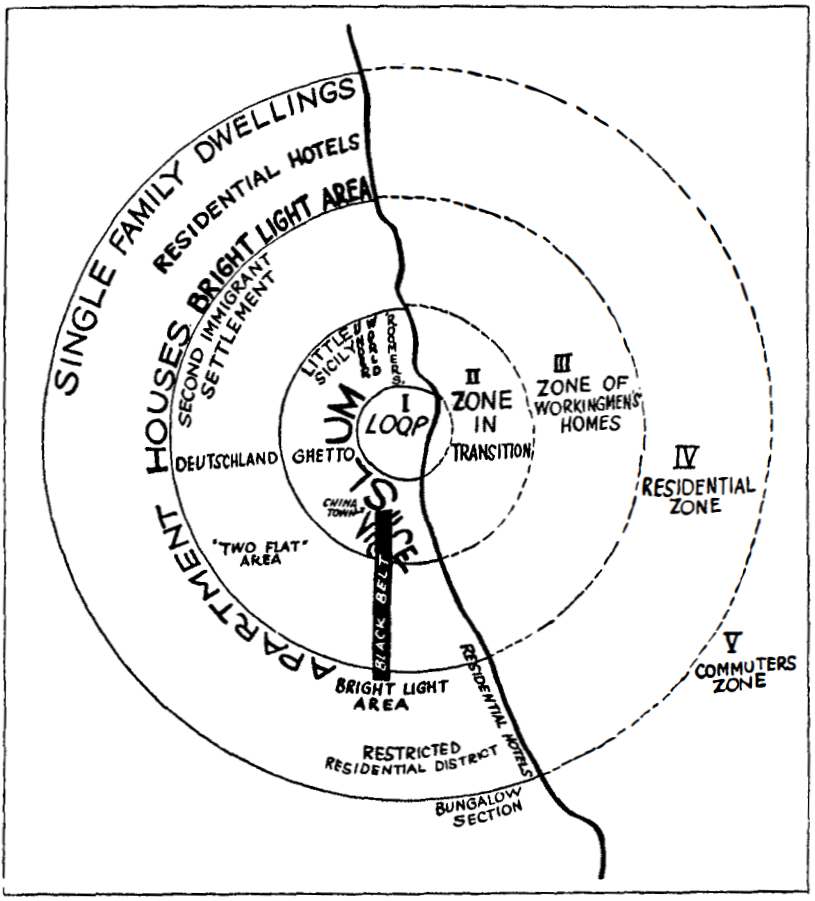
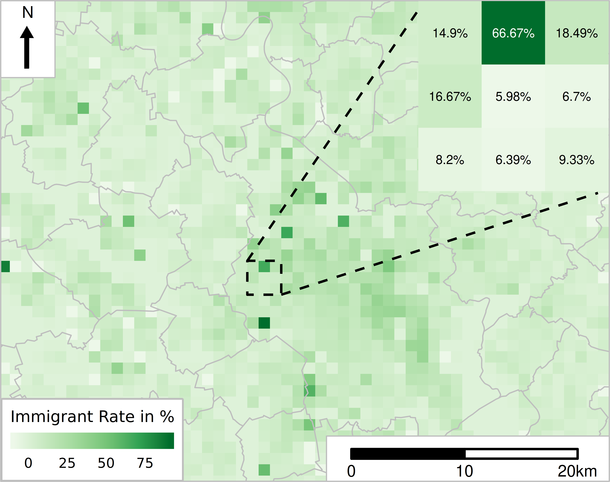
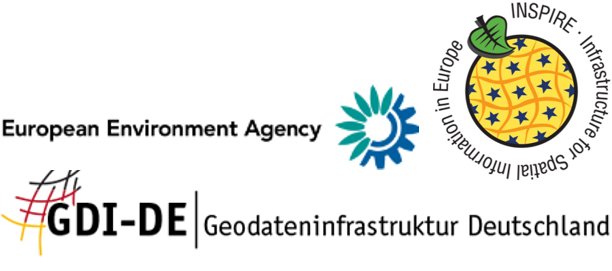
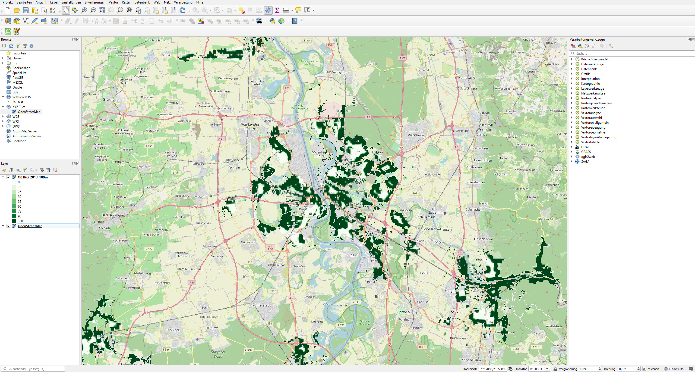
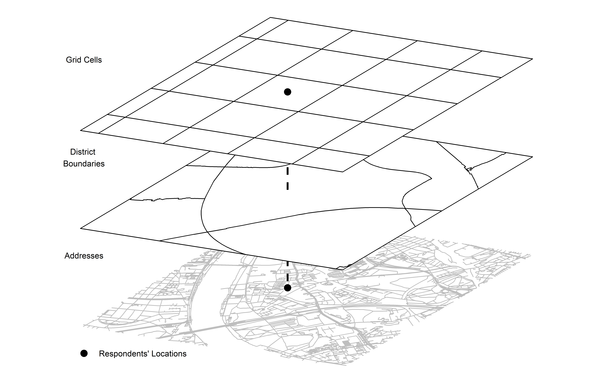
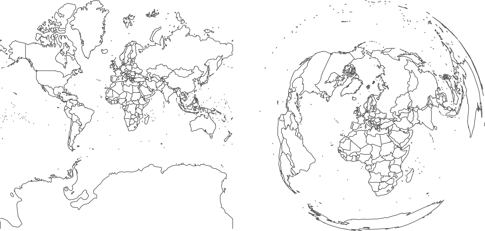

layout: true

```{r init-chunk, include = FALSE}
# load all packages
source("../../R/load_packages.R")

opts_chunk$set(echo = TRUE, fig.align = "center", message = FALSE, cache = TRUE)

# load course content table
source("../../R/course_content.R")

options(warn = -1)

xaringanExtra::use_xaringan_extra(c("tile_view", "clipboard"))
xaringanExtra::use_extra_styles(
  hover_code_line = TRUE,         #<<
  mute_unhighlighted_code = FALSE  #<<
)
```

---

## About This Course

This course will teach you how to exploit `R` and apply its geospatial techniques in a social science context.

By the end of this course, you should...

- be comfortable with using geospatial data in `R`
  - including importing, wrangling, and exploring geospatial data
- be able to create maps based on your very own processed geospatial data in `R`
---

## Keep Calm and Carry On Learning/Using `R`

```{r, learn-r-cartoon, out.width = "50%", echo = F}
include_graphics("./img/r_first_then.png")
```
<small><small>Illustration by [Allison Horst](https://github.com/allisonhorst/stats-illustrations) </small></small>

---

## This Is Not a Spatial Statistics Course

The topic of spatial statistics would require a focus on actual statistics rather than hands-on data wrangling. Therefore, we decided to skip the subject of spatial statistics. We won't take a closer look at:
- The concept of spatial dependence, its modeling using spatial weight matrices, and analysis (e.g., Moran's I)
- Spatial regression

--

Still, all of these topics can be approached using `R`, e.g., with the packages
- [`spdep`](https://bookdown.org/yihui/rmarkdown/xaringan-key.html)
- [`spatstat`](https://cran.r-project.org/web/packages/spatstat/index.html)
- [`spatialEco`](https://cran.r-project.org/web/packages/spatialEco/index.html)
- and so many more

---

## We Are (Necessarily) Selective

There's a multitude of spatial `R` packages
- we cannot cover all of them
- you may have used some we are not familiar with

--

We show the use of packages we exploit in practice
- there's always another way of doing things in `R`
- don't hesitate to bring up your solutions

--

We cannot cover all functions in the packages we use for data wrangling and geometric analysis.

**You can't learn everything at once, but you also don't have to!**

---

## Prerequisites for This Course

- At least basic knowledge of `R`, its syntax, and internal logic
  - Affinity for using script-based languages (`Stata` and `Python` are also great)  
  - Don't be scared to wrangle data with complex structures
- Working versions of `R` (and `Rstudio`) on your computer 
  - Ideally, with the packages installed, we asked you upfront

---

## About Us

**Stefan Jünger**

- Postdoctoral researcher in the team Data Linking & Data Security at the GESIS Data Archive
- Interim Head of the GESIS Secure Data Center
- Ph.D. in social sciences, University of Cologne
- (other) research interests:
  - quantitative methods
  - social inequalities & attitudes towards minorities
  - data management & data privacy
  - reproducible research

[stefan.juenger@gesis.org](mailto:stefan.juenger@gesis.org) |
[@StefanJuenger](https://twitter.com/StefanJuenger) |
[https://stefanjuenger.github.io](https://stefanjuenger.github.io)

---

## About Us

**Anne-Kathrin Stroppe**

- Doctoral researcher in the team National Surveys at the GESIS Data Archive
- Data Curator for the German Longitudinal Election Study
- Research focuses on political and electoral geography
- (other) research interests:
  - determinants of electoral behavior
  - infrastructural inequalities & political alienation
  - quantitative methods of the social sciences

[anne-kathrin.stroppe@gesis.org](mailto:anne-kathrin.stroppe@gesis.org) |
[@AStroppe](https://twitter.com/AStroppe)

---

## About You

- What's your name?  
- Where do you work/study? What are you working on/studying?
- What is your experience with `R` or other programming languages?
- Do you already have experience with geospatial data?
- What statistical software package(s) do you typically use?
- **What do you want to use `R` and geospatial data for?**

---

## Preliminaries

- The workshop consists of a combination of lectures and hands-on exercises
- Feel free to ask questions at any time
  - if it is a question that everybody can/should hear, use the "raise hand" function in *Zoom*, wait until we call you, and then ask via audio/video
- Please mute your microphones unless you are asking a question
- Slides and other materials are available at

.center[`https://github.com/StefanJuenger/gesis-workshop-geospatial-techniques-R`]

---

## Course Schedule

```{r course-content, echo = FALSE}
course_content
```

---

## Now

```{r course-content-now, echo = FALSE}
course_content %>%
  kableExtra::row_spec(1, background = "yellow")
```

---

## Geographic Information in Social Science Research

.pull-left[
Exploiting geographic information is not new.

For example, Siegfried (1913) has used soil composition information to explain election results in France.
]

.pull-right[
```{r siegfried-pic, echo = FALSE, out.width = "75%"}
knitr::include_graphics("https://images.fr.shopping.rakuten.com/photo/874882994.jpg")
```
.center[.tinyisher[https://images.fr.shopping.rakuten.com/photo/874882994.jpg]]
]

---

##Integration in Theory

.pull-left[
```{r allport-pic, echo = FALSE, out.width = "65%"} 
knitr::include_graphics("https://i.gr-assets.com/images/S/compressed.photo.goodreads.com/books/1387595670l/7034925.jpg")
```
.center[.tinyisher[https://i.gr-assets.com/images/S/compressed.photo.goodreads.com/books/1387595670l/7034925.jpg]]
]

.pull-right[
A lot of classic theories have space embedded

For example, in Allport's (1954) contact theory, he at least implicitly assumes that people meet in a set space
]

---

## Today’s Research Is Not Necessarily New

.pull-left[
```{r park-etal-pic, echo = FALSE}

```
.tinyisher[Park et al. 1925]
]

--

.pull-right[
```{r our-stuff-pic, echo = FALSE}

```
.tinyisher[Jünger 2019]
]

---

## Data Landscape

.pull-left[
Increased amount of available data
- Quantitative and on a small spatial scale

</br>

```{r pic-tools, echo = FALSE, out.width = "60%"}

```
]

.pull-right[
```{r pic-geo, echo = FALSE}

```

Better tools
- Personal computer with enough horsepower
- Standard software, such as `R`, can be used as Geographic Information System (GIS)
]

---

## What Are Georeferenced Data?

.pull-left[
</br>
Data with a direct spatial reference $\rightarrow$ **geo-coordinates**
- Information about geometries
- Optional: Content in relation to the geometries
]

.pull-right[
```{r pic-geometries-1, echo = FALSE, out.width = "85%"}
knitr::include_graphics("./img/fig_geometries.png")
```

.tinyisher[Sources: OpenStreetMap / GEOFABRIK (2018), City of Cologne (2014), and the Statistical Offices of the Federation and the Länder (2016) / Jünger, 2019]
]

---

## Geospatial Data

</br>

Essentially georeferenced data as defined before
- Information about geometries and related information

Can be projected jointly in one single space
- Allows data linking and extraction of substantial information

</br>

.center[**This is why they can serve as auxiliary information, i.e., context data, for survey data!**]

---

## Geospatial Data in This Course I

In the folder called `data` in the same folder as the other materials for this workshop, you can find the data files we prepped for all the exercises and slides. The following data are included:

- Administrative borders of Germany (Prefix *GER_*) are provided by the German [Federal Agency for Cartography and Geodesy](http://www.bkg.bund.de)(2018). Check out their [Open Data Portal](https://gdz.bkg.bund.de/index.php/default/open-data.html).

- The hospital locations are based on the register of hospitals and preventive care/rehabilitation facilities 2017 published by the [Federal Statistical Office Germany](https://www-genesis.destatis.de/genesis/online). Addresses were geocoded and -referenced by Anne. 

---

## Geospatial Data in This Course II

- Data on Covid-19 cases and deaths as of Feb 2nd, 2021 were prepared by the Robert-Koch-Institut and downloaded from the [NPGEO data hub](https://npgeo-corona-npgeo-de.hub.arcgis.com/datasets/917fc37a709542548cc3be077a786c17_0).

-  Election Results for the German Right-Wing Populist Party *AfD* in the 2017 German federal election ([Der Bundeswahlleiter, Wiesbaden 2018](https://www.bundeswahlleiter.de/bundestagswahlen/2017/ergebnisse/weitere-ergebnisse.html)).

- German Census 2011 data are provided by the [Federal Statistical Office Germany, Wiesbaden 2020](https://www.zensus2011.de/EN/Home/home_node.html)

---

## Geospatial Data in This Course III

- Shapefiles for Cologne are gathered from the [Open Data Portal Cologne](https://www.offenedaten-koeln.de/)

- Raster data on land use are provided by the Leibniz [Institute of Ecological Urban and Regional Development](https://www.ioer.de/1/home/) through the [Monitor of Settlement and Open Space Development (IOER Monitor)](https://www.ioer-monitor.de/en/)

**Please make sure that if you reuse any of the provided data to cite the original data sources.**

---

## What Is GIS?

Most common understanding: Geographic Information Systems (GIS) as specific software to process geospatial data for 
- Visualization
- Analysis

```{r pic-gis, echo = FALSE, out.width = "70%", fig.align = "center"}

```

.center[.tinyisher[Screenshot of the Open Source GIS [`QGIS`](https://qgis.org)]]

---

## Data Specifics

.pull-left[
</br>
</br>
```{r pic-geometries-2, echo = FALSE}

```

.tinyisher[Sources: OpenStreetMap / GEOFABRIK (2018) and City of Cologne (2014)]
]

.pull-right[
Formats
- Vector data (points, lines, polygons)
- Raster data (grids)

Coordinate reference systems
- Allow the projection on earth's surface
- Differ in precision for specific purposes
]

---

## Layers Must Match!

</br>
```{r pic-crs, echo = FALSE}

```

.tinyisher[Source: Statistical Office of the European Union Eurostat (2018) / Jünger, 2019]

---

## Types of CRS

**Geographic CRS**
- description of specific points
- perfect for navigation as it creates straight lines between points

**Projected CRS**
- projection of geometries on a (flat) surface
- straight lines become bent lines


(There are also geocentric CRS requiring also a z-coordinate...)

*In practice, you shouldn't worry too much about CRS. Again, what matters is that they match.*

---

class: middle

## Short Break `r emo::ji("hot_beverage")`

Grab one of your favorite hot or cold beverages, or take a stretch break.

If you're back at your place, you may want to play around with geometries on this site: https://thetruesize.com

---

## A Bit More About CRS

A lot of software relies on open libraries comprising information about CRS. 
- to project geometries on earth's surface
- to convert one dataset's CRS to another CRS system

---

## Old Standard: `PROJ.4` Strings

This is how you information about the CRS are defined in a classic standard:


```
+proj=laea +lat_0=52 +lon_0=10 +x_0=4321000 +y_0=3210000 +ellps=GRS80 +towgs84=0,0,0,0,0,0,0 +units=m +no_defs 
```

.tinyisher[Source: https://epsg.io/3035]

(It's nothing you would type by hand)

---

## New Kid in Town: `WKT` (“Well Known Text”)

```
PROJCS["ETRS89 / LAEA Europe",
    GEOGCS["ETRS89",
        DATUM["European_Terrestrial_Reference_System_1989",
            SPHEROID["GRS 1980",6378137,298.257222101,
                AUTHORITY["EPSG","7019"]],
            TOWGS84[0,0,0,0,0,0,0],
            AUTHORITY["EPSG","6258"]],
        PRIMEM["Greenwich",0,
            AUTHORITY["EPSG","8901"]],
        UNIT["degree",0.0174532925199433,
            AUTHORITY["EPSG","9122"]],
        AUTHORITY["EPSG","4258"]],
    PROJECTION["Lambert_Azimuthal_Equal_Area"],
    PARAMETER["latitude_of_center",52],
    PARAMETER["longitude_of_center",10],
    PARAMETER["false_easting",4321000],
    PARAMETER["false_northing",3210000],
    UNIT["metre",1,
        AUTHORITY["EPSG","9001"]],
    AUTHORITY["EPSG","3035"]]
```

.tinyisher[Source: https://epsg.io/3035]

---

## Current Transition From `PROJ.4` to `WKT` in `R`

Currently, there's a transition from the bit old standard of `PROJ.4` to `WKT` in many `R` packages.
- you'll get a lot of warnings (see next slide)
- you should check what's causing the warning
- in the best case, they will disappear in the future

However, for the operations we are going to show...


---

## ...Just Ignore the Warnings

You may particularly face some warnings when using the `raster` package (see this afternoon's session about these data). Again, as always in `R`, that's just a warning. [You can ignore it](https://gis.stackexchange.com/questions/365296/setting-crs-of-raster-to-epsg-3035-using-r) since it's a result of the current transition of CRS definitions in individual packages.

```
Warning message:
In showSRID(uprojargs, format = "PROJ", multiline = "NO") :
  Discarded datum European_Terrestrial_Reference_System_1989 in CRS definition
```

I have turned these warnings off for legibility reasons in my slides.

---

## EPSG Codes And EPSG:3035

Eventually, it's not as challenging to work with CRS in `R` as it may seem
- we don't have to use PROJ.4 or WKT strings directly.

Most of the times it's enough to use so-called EPSG Codes ("European Petroleum Survey Group Geodesy")
- Small digit sequence

**During the course, we rely on the European Terrestrial Reference System EPSG:3035, but that's maybe just a matter of taste.**

---

## More Details on Geospatial Data

There's no more on geospatial data and their quirks for the time being.

Let's learn about them as we learn about specific formats:
- vector data (soon)
- raster data (this afternoon)

It should not be surprising in light of this course's content: `R` can serve as a full-blown Geographic Information System (GIS) for all these data.

---

## `R` Packages for Geospatial Data

There have been packages for geospatial data in `R` already for a long time.
- [`sp`](https://cran.r-project.org/web/packages/sp/index.html) for vector data
- [`raster`](https://cran.r-project.org/web/packages/raster/index.html) for raster data

.pull-left[
Cutting-edge for vector data
- [`sf`](https://cran.r-project.org/web/packages/sf/index.html), which implements the [ISO 19125](https://www.iso.org/standard/40114.html) standard for geospatial data, called "simple features".
]

.pull-right[
```{r pic-sf, echo = FALSE, out.width = "75%"}
knitr::include_graphics("./img/sf.jpg")
```

.tinyisher[Illustration by [Allison Horst](https://github.com/allisonhorst/stats-illustrations)]
]

---

## Packages in This Course

We will use plenty of different packages during the course, but only a few are our main drivers (e.g., the `sf` package). Here's the list of packages

.pull-left[
- [`dplyr`](https://cran.r-project.org/web/packages/dplyr/index.html)
- [`ggplot2`](https://cran.r-project.org/web/packages/ggplot2/index.html)
- [`ggsn`](https://cran.r-project.org/web/packages/ggsn/index.html)
- [`haven`](https://cran.r-project.org/web/packages/haven/index.html)
- [`maptools`](https://cran.r-project.org/web/packages/maptools/index.html)
- [`osmdata`](https://cran.r-project.org/web/packages/osmdata/index.html)
- [`OpenStreetMap`](https://cran.r-project.org/web/packages/OpenStreetMap/index.html)
- [`reticulate`](https://cran.r-project.org/web/packages/reticulate/index.html) (optional)
- [`sf`](https://cran.r-project.org/web/packages/sf/index.html)
]

.pull-right[
- [`spatstat`](https://cran.r-project.org/web/packages/spatstat/index.html)
- [`stars`](https://cran.r-project.org/web/packages/stars/index.html)
- [`tmap`](https://cran.r-project.org/web/packages/tmap/index.html)
- [`tmaptools`](https://cran.r-project.org/web/packages/tmaptools/index.html)
- [`raster`](https://cran.r-project.org/web/packages/raster/index.html)
- [`z11`](https://github.com/StefanJuenger/z11)
]

*Note*: Some additional packages will be installed as dependencies.

---

class: middle
## Exercise 1_1_1: Package Installation

[Exercise](https://stefanjuenger.github.io/gesis-workshop-geospatial-techniques-R/exercises/1_1_1_Package_Installation_question.html)

[Solution](https://stefanjuenger.github.io/gesis-workshop-geospatial-techniques-R/solutions/1_1_1_Package_Installation_solution.html)

---

class: middle
## Some Last Notes on Using `R`

---

## What Is `R`?

>R is a free software environment for statistical computing and graphics. It compiles and runs on a wide variety of UNIX platforms, Windows and MacOS ([`R` Project website](https://www.r-project.org/)).

`R` is [free and open-source software (FOSS)](https://en.wikipedia.org/wiki/Free_and_open-source_software) and also a programming language. More specifically, it is a free, non-commercial implementation of the [`S` programming language](https://en.wikipedia.org/wiki/S_(programming_language) (developed by Bell Laboratories).

---

## Base `R` vs. `Tidyverse`

There's only one `R`. However, due to the enormous amount of additional packages, routines for similar purposes can shape up rather differently.

A prime example is the [`Tidyverse`](https://www.tidyverse.org/)
- collection of packages for data science
- tools to import, wrangle, and visualize data

`Tidyverse` is sometimes a bit easier for beginners
- verbs in the `dplyr` package
- non-standard evaluation (`column_name` vs. `"column_name"`)
- pipes (in contrast to nested functions)

---

## Piping In `R`

Usually, in `R` we apply functions as follows:

```{r function-r, eval = FALSE}
f(x)
```

In the logic of pipes this function is written as:

```{r function-pipe,  eval = FALSE}
x %>% f(.)
```

--

We can use pipes on more than one function:

```{r function-pipe-2, eval = FALSE}
x %>% 
  f_1() %>% 
  f_2() %>% 
  f_3()
```

More details: https://r4ds.had.co.nz/pipes.html

---

## Some Precocious Notes on Style
.pull-left[
In some ways, writing code is similar to writing a novel; it's a craft where you set the tone of how you want to be perceived by your future-you and others.
  
What helps to be understood is the styling of your code.
]

.pull-right[
```{r out.width = "70%", echo = FALSE}
include_graphics("./img/on_writing_king.jpg")
```
.tinyisher[https://images-na.ssl-images-amazon.com/images/I/71z4varBITL.jpg]
]

---

## General Elements of Style
These are only some of the topics you will face when researching for styling your code.
- line length (see the ["sacred 80 column rule"]( https://www.emacswiki.org/emacs/EightyColumnRule))
- indentions
- variable/object naming
- comments
- assignment rules

`R` is pretty flexible in styling, which is why it is necessary to think about these topics
- compare that to `Python`, which has strict indention rules

---

## Style Guides out There
It's not uncommon to follow a specific style guide that already exists.

Many institutions define styles for several different programming languages, such as [Google's style guide for `R`](https://google.github.io/styleguide/Rguide.html)

It doesn't matter what style you use as long as you are consistent (at least in one single `R`-file, right?).

---

## Coding in Style `r emo::ji("sunglasses")`

[The `tidyverse` style guide](https://style.tidyverse.org/) by Hadley Wickham  
  
[`styler`](http://styler.r-lib.org/) package (incl. RStudio add-in)

```{r install & load styler, eval = F, echo = T}
install.packages("styler")
library(styler)
```

From the package documentation:
- `style_file()` styles .R and/or .Rmd files.
- `style_dir()` styles all .R and/or .Rmd files in a directory.

```{r, out.width = "50%", echo = FALSE}
include_graphics("./img/styler_addin.png")
```

---

## Namespaces `::`

I (again, Stefan) heavily use namespace declarations in code: `::`. It's a way to safely call a function if there are the same function names in other packages loaded. Usually, you don't need that, but it's a transparent way to show from which package you call which function. 

No namespaces:

```{r without-namespaces, eval = FALSE}
library(sf)

st_buffer(fancy_data, 500)
```

With namespaces:

```{r namespaces, eval = FALSE}
sf::st_buffer(fancy_data, 500)
```

---

class: middle
## Break `r emo::ji("hot_beverage")`

---

layout: false
class: center
background-image: url(./assets/img/the_end.png)
background-size: cover

.left-column[
</br>
```{r pic-me, echo = FALSE, out.width = "90%"}
knitr::include_graphics("./img/stefan.png")
```
]

.right-column[
.left[.small[`r icon::fontawesome("envelope")` [`stefan.juenger@gesis.org`](mailto:stefan.juenger@gesis.org)] </br>
.small[`r icon::fontawesome("twitter")` [`@StefanJuenger`](https://twitter.com/StefanJuenger)] </br>
.small[`r icon::fontawesome("github")` [`StefanJuenger`](https://github.com/StefanJuenger)] </br>
.small[`r icon::fontawesome("home")` [`https://stefanjuenger.github.io`](https://stefanjuenger.github.io)]] </br>
]