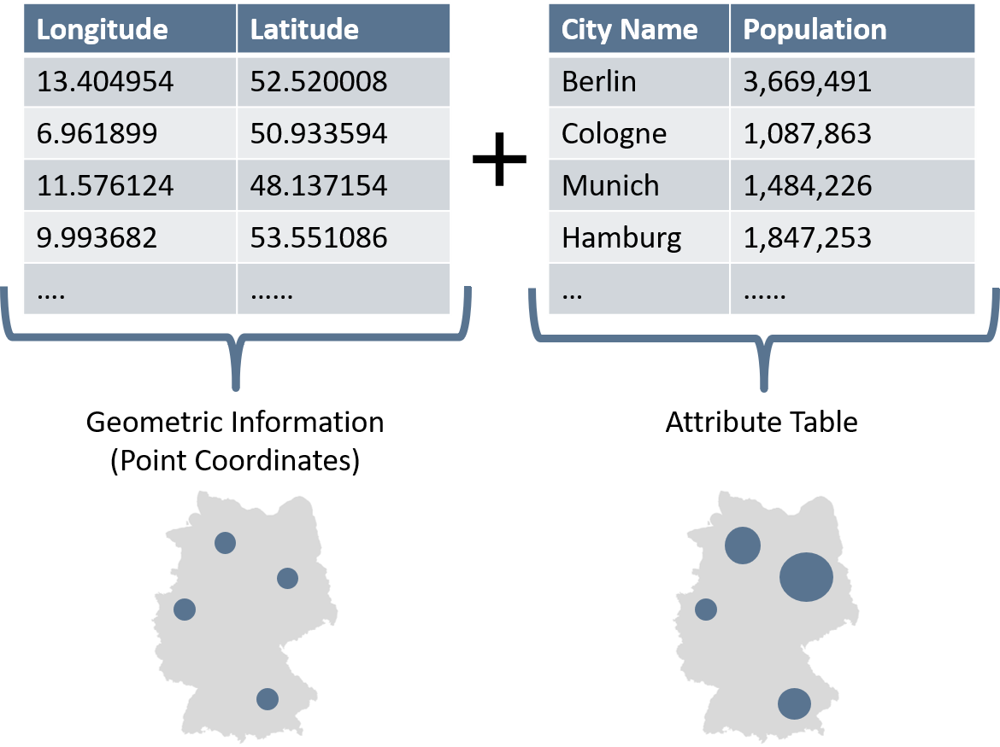
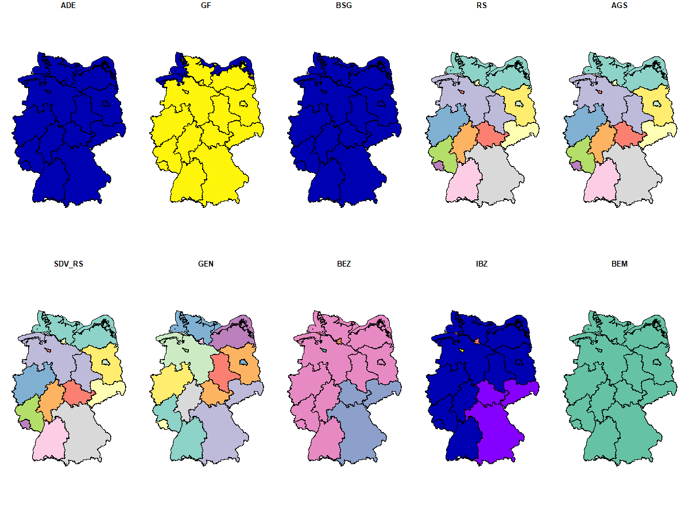

layout: true

```{r init-chunk, include = FALSE}

# load all packages
source("../../R/load_packages.R")

opts_chunk$set(echo = TRUE, fig.align = "center", message = FALSE, cache = TRUE)

# load course content table
source("../../R/course_content.R")

options(warn = -1)

xaringanExtra::use_xaringan_extra(c("tile_view", "clipboard"))
xaringanExtra::use_extra_styles(
  hover_code_line = TRUE,         #<<
  mute_unhighlighted_code = FALSE  #<<
)
```

---

## Now

```{r course-content-now, echo = FALSE}
course_content %>%
  kableExtra::row_spec(2, background = "yellow")
```

---

## Why care about data types and formats?

There is a difference in how spatial information is stored, processed, and visually represented.
What does this mean for us?
 - Different commands to import and handle the data
 - Spatial linking techniques and analyses partially determined by the data format
 - Visualization of data can differ

So: Always know what kind of data you are dealing with!

---

## Representing the world in vectors

.pull-left[
.center[
```{r world-cities, echo = F, out.width= "120%"}
data(World, metro)

tm_shape(World) +
  tm_borders()+
tm_shape(metro) +
  tm_dots()
```
]
]

.pull-right[
In a nutshell, the surface of the earth is represented by simple geometries and attributes assigned to each of these features.

What usually comes as vector data:
  - administrative borders 
  - rivers and roads, 
  - buildings, cities, and more

Georeferenced coordinates are the basis of vector data. 
Every object is defined by longitude (x) and latitude (y).
]

---

## Vector data: Geometries
.pull-left[
Each real-world features is represented as one of three types of geometries:
- Points: discrete location (f.e., city)
- Lines: linear feature   (f.e., river)
- Polygons: enclosed area  (f.e., country)

However, the geometries are not fixed. 
A city might be represented as a point on the world map, but if you zoom in, take a polygon shape.
]

.pull-right[
```{r vector-geo, echo = FALSE, out.width = "90%"}
knitr::include_graphics("./img/vector_geometries.png")
```
<br>
<small><small><small> National Ecological Observatory Network (NEON), cited by [Datacarpentry](https://datacarpentry.org/organization-geospatial/02-intro-vector-data/)</small></small></small>
]

---

## Vector data: Attribute tables

The geometries of vector data hold firstly and foremost only up to three information:
  - location (points, lines, and polygons)
  - length (lines and polygons)
  - area (polygons)
    
We need to assign attributes to each geometry to hold additional information.
Thereby, attribute tables correspond to data tables.
Each row represents a geometric object, which we can also call observation or case.
Each column holds an attribute or, in "our" language, a variable.

---

## Vector data: Attribute tables

.center[
```{r attr-table, echo = FALSE, out.width = "90%"}

```
]

---

## New best friend: Shapefiles

Both the geometric information and attribute table can be saved within one file.
Most commonly, we use *ESRI Shapefiles* to store vector data.
They hold the information on the geometric type, location, and coordinate reference system and additionally store the attributes.
Even though we import only one file, shapefiles consist of at least three mandatory files with the extensions:
  - .shp : shape format
  - .shx : shape index format
  - .dbf : attribute format
  - (.prj: CRS/Projection)
  
You don't have to remember what they are standing for, but know that you won't be able to load the data if one of those files is missing.

---

## First summary 

1. Vector data come in three different geometric types: points, lines, polygons.

2. The geometric information is joined by an attribute table holding information for each geometric object.

3. Attribute tables can be treated as data tables.

4. Everything is stored in a Shapefile.

Let's give this some context and get to know vector data in R!

---

## Welcome to `simple features`

.pull-left[
.small[
Several packages are out there to wrangle and visualize spatial and, especially, vector data within `R`.
We are fans of a package called `sf` ("simple features").

Why? 
`simple features` refers to a formal standard representing spatial geometries and supports interfaces to other programming languages and GIS systems.
As a bonus, it allows us to work in a `tibble` environment.
You might come across other packages, like `sp`, but we advise you to focus on `simple features` whenever possible. 
]
]

.pull-right[
```{r echo = FALSE}
knitr::include_graphics("./img/sf.jpg")
```
<small><small>Illustration by [Allison Horst](https://github.com/allisonhorst/stats-illustrations) </small></small>
]

---

## Load a shapefile

The first step is, of course, loading the data.
We want to import the shapefile with the layer of the administrative borders of the German states (*Bundesländer*) called `GER_STATES`.


```{r load-germanstates-display, eval = F}
# load library
library(sf)

# define at least the data source name (dsn)
# and the layer name 
german_states <- st_read(dsn = "./data",
                        layer = "GER_STATES")
```

```{r load-germanstates, echo = F}

library(sf)

german_states <- st_read(dsn = "../../data",
                           layer = "GER_STATES")
```

---

## Inspect your data: Classics

Let's have a quick look at the imported data.
Like every other data set, we inspect the data to check some metadata and see if the importing worked correctly.

```{r data-inspection-classy}
# object type
class(german_states) 

# number of rows
nrow(german_states)

# number of columns
ncol(german_states)

```

---

## Inspect your data: Classics

You can see that there are no huge differences between the shapefile, we just imported, and a regular data table.

```{r data-inspection-head}

# head of data table
head(german_states)

```

---

## Inspect your data: Spatial features

Besides our general data inspection, we also want to check the spatial features of our import.
This includes the geometric type (points? lines? polygons?) and the coordinate reference system.

```{r data-inspection-stgeo}
# type of geometry
st_geometry(german_states) 
```


---
## Inspect your data: Spatial features

Since we have a polygon shapefile, the geometry column consists of a list with two columns: latitude and longitude. Hence, each polygon is defined by several points that are connected to build an enclosed area. Several polygons in one data frame have the `sf` type multipolygons. Just as Germany consists of several states, the polygon Germany consists of several smaller polygons.

```{r data-inspection-stattr}
# the simple features column
attr(german_states, "sf_column") 

# further inspecting 
glimpse(german_states$geometry)
```

---

## Inspect your data: Spatial features

Remember: Stefan already introduced why the Coordinate Reference System is so important.
And that we personally prefer the EPSG:3035 as a standard CRS.
A crucial step is to check the CRS of your geospatial data.

```{r data-inspection-crs}
# coordinate reference system
st_crs(german_states) 
```

---

## `st_transform`

When a CRS is messed up, or one wants to combine data with not matching CRS, it will all go downwards.
The good thing is that the command `st_transform` allows us to  *translate* our spatial data from one coordinate reference system to another.

```{r st-transform}
# transform crs
german_states <- st_transform(german_states, crs = 3035)

# check crs
st_crs(german_states) 
```

---

## A very, VERY first map

We looked at all kinds of information of our data set without seeing a single map.
Making good maps is an art on its own; see the upcoming session.
But for inspecting the data and check if we actually loaded what we want to load, we can have a
very first glimpse.

```{r first-glimpse, eval = F}
# plot sf object
plot(german_states) 
```
.center[
```{r plot-states, echo = FALSE, out.width = "60%"}

```
]

---

## Import point layer

Unfortunately, the data we want to visualize or analyze are not always available as shapefiles.
Especially, point coordinates are often stored in table formats like `.csv` - as are the location of German hospitals in our `data` folder. 

```{r load-hospitals-display, eval = F}

hospitals_df <- read.csv("./data/hospital_points.csv", 
                         header = T, 
                         fill = T, 
                         sep = ",")

```

```{r load-hospitals, echo = F}

hospitals_df <- read.csv("../../data/hospital_points.csv", header = T, fill = T, sep = ",")

head(hospitals_df)
```

---

## From data table to geospatial data

We see that besides our attributes (e.g., year of data collection, number of beds...), the table contains the two variables "X" and "Y", our point coordinates.
When using the command `st_as_sf`, make sure to use the option `crs = [EPSG_ID]`.
If not used, your CRS will not be defined, and you won't perform further commands depending on the CRS.
Good thing that Anne was the one who geocoded the addresses, and we know that the data are most likely stored in EPSG:3035.

.pull-left[
```{r plot-hospitals-sf-display, eval = F}

# transform to spatial data frame
hospitals_sf <- st_as_sf(hospitals_df,    
                         coords = c("X", "Y"),
                  crs = 3035)

# inspect data
class(hospitals_sf)
st_geometry(hospitals_sf)
```
]

.pull-right[
```{r transform-hospitals, echo = F}

# transform to spatial data frame
hospitals_sf <- st_as_sf(hospitals_df, coords = c("X", "Y"),
                  crs = 3035)

# inspect data
class(hospitals_sf)
st_geometry(hospitals_sf)
```
]

---

## Our point data

```{r plot-hospitals, out.width = "55%"}

plot(hospitals_sf)

```

---

## ... and the other way round

You already have enough spatial data, simple features, and co?
Do you want to go back to handling a simple data frame?
Here is your chance!
You can quickly achieve this by drop the geometry column.

```{r remove-geometry}
# check class
class(german_states)

# remove geometry
st_drop_geometry(german_states) %>% 
  head(.,3)

```

---

class: middle
## Exercise 1_2_1: Import Vector Data 

[Exercise](https://stefanjuenger.github.io/gesis-workshop-geospatial-techniques-R/exercises/1_2_1_Import_Vector_Data_question.html)

[Solution](https://stefanjuenger.github.io/gesis-workshop-geospatial-techniques-R/solutions/1_2_1_Import_Vector_Data_solution.html)

---

## Data wrangling

After importing the data sets, we are now ready to manipulate our data. 
In general, data manipulation of the attribute tables of simple feature objects can be done with all usual data manipulation commands in *R/RStudio*.
We are working here with the `dplyr` package to manipulate the data frames for all regular data wrangling tasks.
But if you are used to working with the base R language, feel free to do so.

.center[
```{r echo = FALSE, out.width = "50%" }

```
<small><small>Meme found on [Reddit](https://www.reddit.com/r/Rlanguage/comments/anv1d5/my_meme_of_the_day/?utm_source=share&utm_medium=web2x&context=3) </small></small>
]

---

## Data Intro: German Districts

A new task means new data!
We're moving "a layer down" and look at Germany on a more fine-grained spatial level: the district.
The layer is called *GER_DISTRICTS* and contains only one additional attribute (id).

```{r load-district-display, eval = F}

german_districts <- st_read(dsn = "./data",
                           layer = "GER_DISTRICTS") %>% 
                     st_transform(. , crs = 3035) 
german_districts
```

```{r load-district, echo = F}

german_districts <- st_read(dsn = "../../data",
                           layer = "GER_DISTRICTS",
                           quiet = T) %>% 
                     st_transform(. , crs = 3035,) 
german_districts
```

---
## German Districts
.small[
```{r plot_districts, echo = F , out.width = "70%"}

plot(german_districts)

```
]
---

## Data Intro: Attributes

Since it would be a little bit boring to work with just one attribute, we prepared an extra table with more attributes called *attributes_districts*.

```{r load-attr-display, eval = F}

attributes_districts <-  read.csv("./data/attributes_districts.csv", 
                                  header = T, 
                                  fill = T,
                                  sep = ",") 

```

```{r load-attr, echo = F}

attributes_districts <-  read.csv("../../data/attributes_districts.csv", 
                                  header = T, 
                                  fill = T, 
                                  sep = ",") 

```

```{r head-district-attr, echo = F, out.width= "60%"}

head(attributes_districts)

```

---

## Add attributes: Join data table

You might already spot that we have an id for the districts (*id* and *district_id*) in both data tables. 
This is a good example how easily `sf` objects can be handled.
With a regular left join of our additional attributes to the `sf` object, we can enhance our geospatial data and add more attributes.

```{r join-attrtable}
german_districts_enhanced <- 
  german_districts %>% 
  rename(., district_id = id) %>% 
  left_join(. , attributes_districts, by = "district_id")  

class(german_districts_enhanced)
head(german_districts_enhanced,2)
```

---
## Add (More) Attributes: Spatial Join, Spatial Intersects, and More

Besides the regular join, we can also perform a so-called *spatial join*.

This is a small outlook for tomorrow on **Applied Data Wrangling**.
For example, we want to count the number of hospitals in each German district.
The hospital point layer was imported and is luckily already in the same CRS as the polygon layer of the German districts.
`st_join` does the trick.

```{r spatial-join}

# perfom spatial join 
hospitals_in_districts <- st_join(hospitals_sf, 
                                  german_districts_enhanced, 
                                  join = st_within)

# count the number of hospitals within a district
hospital_districts_count <- count(as_tibble(hospitals_in_districts), 
                                  district_id) %>%
                           rename(hospital_ct = n)  # optional

# Join the hospital count with the german district 
german_districts_enhanced<- left_join(german_districts_enhanced, 
                                    hospital_districts_count, 
                                    by = "district_id") %>% 
                           mutate(hospital_ct = tidyr::replace_na(hospital_ct, 0)) # optional

```

---

## Subsetting the Data

One might be interested in only one specific area of Germany, like the capital Berlin.
To subset a `sf` object,  you often can use your usual data wrangling workflow. 
In this case, I know the district_id and that is also the only information I want to keep.

.pull-left[
```{r stouches-display, eval = F}

# subsetting
berlin <-
german_districts_enhanced %>% 
  filter(. , district_id == 11000) %>% 
  select(., district_id) 

plot(berlin)

# or in Base R
german_districts_enhanced[which
        (german_districts_enhanced$
            district_id == 11000),
        "district_id"] %>% 
        plot()

```
]

--

.pull-right[
```{r stouches, echo= F}

# subsetting
berlin <-
german_districts_enhanced %>% 
  filter(. , district_id == 11000) %>% 
  dplyr::select(. , district_id) 

plot(berlin)

```
]
---

## Using `sf` for subsetting

If you have no information about *ids* but only about the geolocation, you can use `st_touches` to identify for example all districts which share a border with Berlin.
Spatial relations of object like `touches`, `within`, `intersect`, `crosses` are helpful tools to exploit the geometric information stored in the data when other information are missing.

.pull-left[
```{r surround-display, eval = F}

# subsetting with st_touches
berlin_surrounding <-
german_districts_enhanced %>% 
  select(. , district_id) %>% 
# length of mutual border > 0
  filter(., lengths
         (st_touches(., berlin)) > 0) 

plot(berlin_surrounding)

```
]

--

.pull-right[
```{r surround, echo= F}

# subsetting
berlin_surrounding <-
german_districts_enhanced %>% 
  dplyr::select(. , district_id) %>% 
  filter(lengths(st_touches(., berlin)) > 0) 

plot(berlin_surrounding)

```
]

---

## Export the Data

After Wrangling and adjusting the data, you can save them.
There are, again, several options to do so.
Two notes:
.small[

1.Be careful when saving shapefiles: column names will automatically be abbreviated!
 
2.Make sure that the CRS is included either in your folder or the file name.

]


```{r export-display, eval = F}

# Export as Shapefile
st_write(german_districts_enhanced, 
         dsn = "./own_material/districts_enhanced_epsg3035.shp", 
         layer = "german_districts_enhanced_epsg3035.shp",  # optional
         driver = "ESRI Shapefile",  # optional
         delete_layer = TRUE) #optional

# Export data frame as csv without geometric attributes
german_districts_enhanced_df <- 
  st_set_geometry(german_districts_enhanced, NULL) 

write.csv(german_districts_enhanced , 
          "./own_material/german_districts_enhanced.csv", 
          row.names = F, na= "." )
  
# Export data frame as csv with geometric attributes
st_write(hospitals_sf, "./own_material/hospitals_epsg3035.csv", 
         layer_options = "GEOMETRY=AS_XY")

```

---

class: middle
## Exercise 1_2_2: Manipulate Vector Data 

[Exercise](https://stefanjuenger.github.io/gesis-workshop-geospatial-techniques-R/exercises/1_2_2_Manipulate_Vector_Data_question.html)

[Solution](https://stefanjuenger.github.io/gesis-workshop-geospatial-techniques-R/solutions/1_2_2_Manipulate_Vector_Data_solution.html)

---

## Wrap-Up

.pull-left[
We made it through our first session dealing with vector data!
You can:
  - load
  - transform
  - manipulate 
  - and export vector data.
  
The next step is producing an awesome map! `r emo::ji("confetti")`
]

.pull-right[
```{r cologne-covid, echo=F}

# Import data
german_districts <- st_read(dsn = "../../data",
                           layer = "GER_DISTRICTS",
                           quiet = T) %>% 
                     rename(., district_id = id)

attributes_districts <-  read.csv("../../data/attributes_districts.csv", 
                                  header = T, fill = T, sep = ",") 


# Join data and transform
german_districts_enhanced <- 
  german_districts %>% 
  left_join(., attributes_districts, by = "district_id") %>% 
  st_transform(., crs = 3035)

# calculate Covid-19 rate
german_districts_enhanced <-
  german_districts_enhanced %>% 
  mutate(covid7d_rate = (cases_7days / population) * 100000)

# filter Cologne
cologne <-
  german_districts_enhanced %>% 
  filter(. , district_id == 5315)

# filter surrounding districts, append with Cologne data and select the Covid column
cologne_sur <-
  german_districts_enhanced %>%
  filter(lengths(st_touches(., cologne)) > 0) %>% 
  bind_rows(., cologne) %>%   
  dplyr::select(. , covid7d_rate)

# plot  
plot(cologne_sur)


```
]

---

class: middle
## Lunch Break `r emo::ji("taco")`
.center[
But, that is for after lunch!
]
---

layout: false
class: center
background-image: url(./img/the_end.png)
background-size: cover

.left-column[
</br>
```{r pic-me, echo = FALSE, out.width = "90%"}
knitr::include_graphics("./img/anne.png")
```
]

.right-column[
.left[.small[`r icon::fontawesome("envelope")` [`anne-kathrin.stroppe@gesis.org`](mailto:anne-kathrin.stroppe@gesis.org)] </br>
.small[`r icon::fontawesome("twitter")` [`@AStroppe`](https://twitter.com/AStroppe)] </br>
.small[`r icon::fontawesome("github")` [`Stroppan`](https://github.com/stroppan)] </br>
]
]