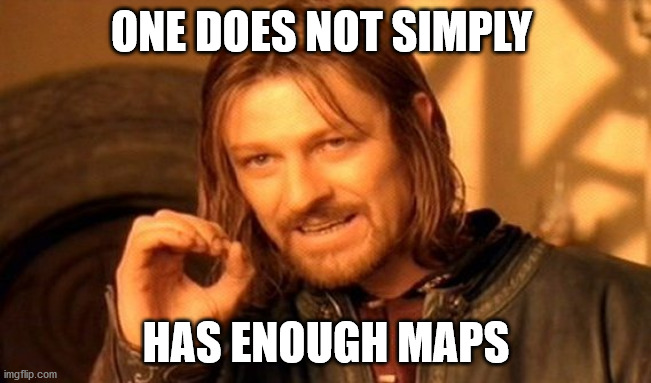

layout: true

```{r init-chunk, include = FALSE}
# load all packages
source("../../R/load_packages.R")

opts_chunk$set(echo = TRUE, fig.align = "center", message = FALSE, cache = TRUE)

# load course content table
source("../../R/course_content.R")

options(warn = -1)

xaringanExtra::use_xaringan_extra(c("tile_view", "clipboard"))
xaringanExtra::use_extra_styles(
  hover_code_line = TRUE,         #<<
  mute_unhighlighted_code = FALSE  #<<
)
```


---
class: middle
## Check-In and Q&A  

.center[
Check-In: [Click here](https://www.menti.com/efi4iyigyg)
]

--

Any questions remaining from the last session you need us to answer?
Any questions concerning the organization of the course?

---

## Now

```{r course-content-now, echo = FALSE}
course_content %>%
  kableExtra::row_spec(4, background = "yellow")
```

---

## Fun with Flags, eh, MAPS

.center[
```{r fun-flags, echo = FALSE, out.width = "90%"}

```
]
<br>
.center[
<small><small><small> Fun with Flags by Dr. Sheldon Cooper. [Big Bang Theory](https://youtu.be/_e8PGPrPlwA)</small></small></small>
]

---

## Fun with Maps

.pull-left[
We already learned how we can make very basic maps using the `plot` function.
However, this command does not allow us to manipulate the maps in any way.
But we already have the two most essential ingredients to create a nice map:

  1. At least one vector layer like an ESRI Shapefile.
  2. Some interesting attributes linked with the geometries.
]

.pull-right[
```{r cologne-covid, echo=F}

# Import data
german_districts <- st_read(dsn = "../../data",
                           layer = "GER_DISTRICTS",
                           quiet = T) %>% 
                     rename(., district_id = id)

attributes_districts <-  read.csv("../../data/attributes_districts.csv", 
                                  header = T, fill = T, sep = ",") 


# Join data and transform
german_districts_enhanced <- 
  german_districts %>% 
  left_join(., attributes_districts, by = "district_id") %>% 
  st_transform(., crs = 3035)

# calculate Covid-19 rate
german_districts_enhanced <-
  german_districts_enhanced %>% 
  mutate(covid7d_rate = (cases_7days / population) * 100000)

# filter Cologne
cologne <-
  german_districts_enhanced %>% 
  filter(. , district_id == 5315)

# filter surrounding districts, append with Cologne data and select the Covid column
cologne_sur <-
  german_districts_enhanced %>%
  filter(lengths(st_touches(., cologne)) > 0) %>% 
  bind_rows(., cologne) %>%   
  dplyr::select(. , covid7d_rate)

# plot  
plot(cologne_sur)


```
]

---

## What Makes a Good Map?

There is a difference between a great and a fantastic map.
And there are hundreds of really, really bad maps out there.
What makes the difference?
.pull-left[
A Good Map:
- reduction to most important information
- legends, scales, descriptions
- audience oriented
- adjusted for color blindness

]
.pull-right[
A Bad Map:
- overcrowding and overlapping
- unreadable information
- missing information like the source
- poor choice of color palettes
]

---

## What Makes a Good Map?

... but there is one other type:

.center[
The fast but nice map.
]

This is what we plan to do now: 

A fast exploration of spatial data by visualizing the geometries and attributes.

They might not be publication-ready yet, but they are more rewarding than just plotting information.

---

## Sophie´s Choice: Packages for Mapping

As always, *RStudio*  offers several ways to map spatial data, and the provided packages are various.
What is out there?
  - base R graphics package: `maps` and [`mapdata`](https://rpubs.com/rbatzing/mapping)
  - mobile-friendly interactive maps: [`leaflet`](https://rstudio.github.io/leaflet/)
  - interactive and static thematic maps based on shapefiles: [`tmap`](https://mran.microsoft.com/snapshot/2014-12-22/web/packages/tmap/vignettes/tmap-nutshell.html)
  - the all-rounder: `ggmap` in [`ggplot2`](https://www.r-spatial.org/r/2018/10/25/ggplot2-sf.html)


---

## Sophie´s Choice: Packages for Mapping

Today, we'll concentrate on the package `tmap`.
- Firstly, it focuses on vector data.
- Secondly, it offers not only static but a quick interactive feature.
- Thirdly, it is very intuitive and makes "good" decisions for us.

Lastly, the syntax is very similar to `ggplot2` and will help us tomorrow when we dive deeper into the art of mapping.
A wide-known secret is that `tmap` creates a map based on `ggplot2`, so `ggplot2`-specific graphics manipulations will work as well.


---

## First Map in Four Lines

Quick Map of Worldwide Life Expectancy?
Here we go! 

There are several build-in shapefiles, like *World*, which we can access by calling `data`.

.pull-left[
```{r first-map-disp, eval=F}
library(tmap)
data("World")

tm_shape(World) +
    tm_fill("life_exp")
```
]

.pull-right[
```{r first-map, echo=F}
library(tmap)
data("World")

tm_shape(World) +
    tm_fill("life_exp")
```
]

---


## `tmap` in a nutshell

There is not much to consider when using `tmap`, but essential two requirements:
  1. Define your spatial object.
  2. Choose a building block to determine how to display information.

```{r tmap-display, eval = F}

# required first step:
# define every (new) shapefile 
tm_shape() +

# required second : 
# choose at least one building block as 'aesthetic layer'
  
# for polygon layer choose from:
    tm_fill() + # polygons without borders
    tm_polygons() +  # polygons with borders
    tm_borders() + # only borders of polygons

# for line layer choose:
    tm_lines() +

# for point layer choose:
    tm_dots() +
    tm_bubbles() +

# for all of them:
?'tmap-element'
```

---

## `tmap` in a nutshell: Polygon layer

.pull-left[
```{r pol-layer-disp, eval=F}

tm_shape(World) +
    tm_fill()

tm_shape(World) +
    tm_polygons()

tm_shape(World) +
    tm_borders()
```
]

--

.pull-right[
```{r pol-layer, echo=F, fig.height=3}

tm_shape(World) +
    tm_fill()
tm_shape(World) +
    tm_polygons()
tm_shape(World) +
    tm_borders()
```
]

---

## `tmap` in a nutshell: Line and Point layer

.pull-left[
```{r line-layerdisp, eval=F, fig.height=4}

# data set rivers
data("rivers")
tm_shape(rivers) +
    tm_lines()

#  metropolitan cities worldwide
data("metro") 
tm_shape(metro) +
    tm_dots()

```
]

--

.pull-right[
```{r line-layer, echo = F, fig.height=4 }
data("rivers") # data set rivers
tm_shape(rivers) +
    tm_lines()

data("metro") # data metropolitan cities worldwide
tm_shape(metro) +
    tm_dots()

```
]
---

## `tmap` in a nutshell: Put it all together

We can map the geometric attributes as single layers, but we can also layer our map and stack the layers on each other.


```{r over-lay-disp, eval = F}

tm_shape(World) +
  tm_polygons() +
tm_shape(rivers) +
  tm_lines() +
tm_shape(metro) +
  tm_dots()

```


```{r over-lay, echo = F, fig.height=3, out.width="80%"}

tm_shape(World) +
  tm_polygons() +
tm_shape(rivers) +
  tm_lines() +
tm_shape(metro) +
  tm_dots()

```


---

## Add Some Information

After we took care of our geometric types, we want to add some information to our data.
The inner construction of each building block of `tm_elements` is the same.
  1. Define the variable of interest first by stating the column name. 
  2. Add a name for legend title, color palette, adjust legend, scales ...

.pull-left[
```{r life-exp-disp, eval = F}

# define variable
tm_shape(World) +
  tm_polygons("life_exp") 


```
]

--

.pull-right[
.center[
```{r life-exp, echo = F}


# define variable
tm_shape(World) +
  tm_polygons("life_exp") 

```
]
]

---

## Add Some Information

After we took care of our geometric types, we want to add some information to our data.
The inner construction of each building block of `tm_elements` is the same.
  1. Define the variable of interest first by stating the column name. 
  2. Add a name for legend title, color palette, adjust legend, scales ...

.pull-left[
```{r add-attributes-disp, eval = F}

# add color, title and more
tm_shape(World) +
  tm_polygons("life_exp",
              palette = "RdPu",
              title = "Life Expectancy",
              style = "kmeans") 

```
]

--

.pull-right[
.center[
```{r add-attributes, echo = F}


# add color, title and more
tm_shape(World) +
  tm_polygons("life_exp",
              palette = "RdPu",
              title = "Life Expectancy",
              style = "kmeans") 

```
]
]

---

## Change the surroundings

We can change the map self, but we can also change the overall layout like title, frame, fonts, margins, legend
position, and more. 
There is another building block organizing everything surrounding our map: `tm_layout`.

.pull-left[
```{r changelayout-disp, eval = F}

# add names
tm_shape(World) +
  tm_polygons("life_exp",
              palette = "RdPu",
              title = "Life Expectancy",
              style = "kmeans") +
  tm_layout(main.title = "Life Expectancy ",
            legend.text.color = "purple",
            legend.title.color = "purple",
            legend.bg.color = "lightgrey",
            legend.outside = TRUE)

```
]

.pull-right[
.center[
```{r change-layout, echo = F}

# add names
tm_shape(World) +
  tm_polygons("life_exp",
              palette = "RdPu",
              title = "Life Expectancy",
              style = "kmeans") +
  tm_layout( main.title = "Life Expectancy Around the World",
             legend.text.color = "purple",
              legend.title.color = "purple",
              legend.bg.color = "lightgrey",
             legend.outside = TRUE)

```
]
]

---

class: middle
## Exercise 1_3_1: Basic Maps

[Exercise](https://stefanjuenger.github.io/gesis-workshop-geospatial-techniques-R/exercises/1_3_1_Basic_Maps_question.html)

[Solution](https://stefanjuenger.github.io/gesis-workshop-geospatial-techniques-R/solutions/1_3_1_Basic_Maps_solution.html)

---

## What's left?

.center[
```{r enough-maps, echo = FALSE, out.width = "70%"}

```
]

---

## Explore Your Data

We just can't get enough of creating maps.

One simple benefit of quick maps: You can explore your data efficiently and make spatial correlations visible.
In the previous months, German researchers and journalists claimed that in areas where the Right-Wing Populist Party *AfD* is supported by voters, the rate of Covid-19 infections is exceptionally high.
The argument supporting this hypothesis is that *AfD* supporters have more conspiracy beliefs and are less compliant with state rules.

Can we support this claim based on our data and our basic map skills?

---

## Map of AfD Support

```{r load-data-hidden,  echo = F}

# code based on the original
german_districts <- st_read(dsn = "../../data",
                            layer = "GER_DISTRICTS",
                            quiet = T) %>% 
  rename(., district_id = id)

attributes_districts <-  read.csv("../../data/attributes_districts.csv", 
                                  header = T, fill = T, sep = ",") 

german_districts_enhanced <- 
  german_districts %>% 
  left_join(., attributes_districts, by = "district_id") %>% 
  st_transform(., crs = 3035)

covid_map <-  
  tm_shape(german_districts_enhanced) + 
  tm_fill(col = "cases_per_100k",
          title = "Covid-19 Cases per 100k",
          palette = "RdPu") +
  tm_layout(main.title = "Covid Cases in Germany",
            main.title.color = "black" ) +
  tm_legend(legend.outside = TRUE,
            legend.outside.position = "right")

```

.pull-left[
```{r afd-map-disp, eval = F}

afd_map <-  
  tm_shape(german_districts_enhanced) + 
  tm_fill(col = 
            "afd_voteshare_2017",
              title = "
            AfD Voteshare (%)",
              palette = 
            "Blues") +
  tm_layout(main.title = 
              "Electoral Success AfD",
            main.title.color = 
              "black" ) +
  tm_legend(legend.outside = 
              TRUE,
            legend.outside.position = 
              "right")

afd_map 
```
]

.pull-right[
```{r afd-map, echo = F}

afd_map <-  
  tm_shape(german_districts_enhanced) + 
  tm_fill(col = "afd_voteshare_2017",
              title = "AfD Voteshare (%)",
              palette = "Blues") +
  tm_layout(main.title = "Electoral Success AfD",
            main.title.color = "black" ) +
  tm_legend(legend.outside = TRUE,
            legend.outside.position = "left")

afd_map 
```
]


---

## AfD Success and Covid-19 Cases

If we place the Covid-19 map created in the exercise and the AfD map right next to each other, we might get a first impression.
The tool we use here is named `tmap_arrange()`.

```{r arranged-display, eval=F}

tmap_arrange(covid_map, afd_map)

```

--

```{r arranged-maps,  echo = F, warning = F, message = F, out.width = "50%"}
tmap_arrange(covid_map, afd_map)
```

---

## AfD Success and Covid-19 Cases

We can see some kind of correlation.

But as we know: Correlation should not be confused with causation. 

We can assume some confounding factors like the sociodemographic composition, state governments' decisions on regulations, or shared borders with other European countries.


---

## Putting on Some Layers

Instead of placing maps next to each other, we can also explore spatial correlations by adding layers.
Another benefit of layering: We can make our map more realistic and aesthetic.

For example, we can add a background layer of neighboring countries, add a layer of German cities, or the German states' borders for orientation.
Each layer can visualize another attribute of our map.

For today, we want to add a layer of hospital point data to our Covid-19 map.


```{r load-hospital-display, eval = F}

# import point layer hospital sf
hospitals_sf <- read.csv("./data/hospital_points.csv", header = T, fill = T, sep = ",") %>%
                st_as_sf(., coords = c("X", "Y"),
                  crs = 3035)  %>% 
                mutate(beds = as.numeric(beds))
```

```{r load-hospital, echo = F,  warning = F, massage = F}

# import point layer hospital sf
hospitals_sf <- read.csv("../../data/hospital_points.csv", header = T, fill = T, sep = ",") %>%
                st_as_sf(., coords = c("X", "Y"),
                  crs = 3035) %>% 
                mutate(beds = as.numeric(beds))
```

---

## Putting on Some Layers 

.pull-left[
```{r hospital-map-disp, eval=F}

# map the hospitals on the covid-19 map
hospital_covid_map <- 
  tm_shape(german_districts_enhanced) + 
  tm_fill(col = 
            "cases_per_100k",
          title = 
            "Covid-19 Cases per 100k",
          palette = 
            "RdPu") +
  tm_layout(main.title = 
              "Covid Cases in Germany",
            main.title.color = 
              "black" ) +
  tm_legend(legend.outside = 
              TRUE,
            legend.outside.position = 
              "left") +
# Add hospital data
tm_shape(hospitals_sf) + 
  tm_dots("beds", 
          col = 
            "black",
          title.size = 
            "Number of Hospital Beds") 
 
hospital_covid_map

```
]

.pull-right[
```{r hospital-map, echo=F, warning=F, message=F}

# map the hospitals on the covid-19 map
hospital_covid_map <- tm_shape(german_districts_enhanced) + 
  tm_fill(col = "cases_per_100k",
          title = "Covid-19 Cases per 100k",
          palette = "RdPu") +
  tm_layout(main.title = "Covid Cases in Germany",
            main.title.color = "black" ) +
  tm_legend(legend.outside = TRUE,
            legend.outside.position = "left") +
tm_shape(hospitals_sf) + 
  tm_dots("beds", 
          col = "black",
          title.size = "Number of Hospital Beds") 
 
hospital_covid_map
```
]

---

class: middle
## Exercise 1_3_2: Fun with Maps (& a Mapp-Off afterwards)

[Exercise](https://stefanjuenger.github.io/gesis-workshop-geospatial-techniques-R/exercises/1_3_2_Fun_with_Maps_question.html)

---

# A Short Note on Mapping Responsible

In the best cases, maps are easy to understand and an excellent way to transport (scientific) messages.

In the worst cases, they simplify (spurious) correlations and draw a dramatic picture of the world.

Maps can shape narratives, and they do not only depend on the manipulation of the data.
Decisions on which projection you use (remember the `true size` projector?), the segment of the world you choose, and the colors you add have a strong influence.

As an example, check out this fantastic blog post on **mapping the Coronavirus responsible** by [Kenneth Field](https://www.esri.com/arcgis-blog/products/product/mapping/mapping-coronavirus-responsibly/)

---

## Wrap-Up

If you want to dive deeper into mapping with `tmap` check out:
  - Introduction by [Thomas Lo Russo](https://tlorusso.github.io/geodata_workshop/tmap_package)
  - Blogpost by [Hollie Zevross](http://zevross.com/blog/2018/10/02/creating-beautiful-demographic-maps-in-r-with-the-tidycensus-and-tmap-packages/)
  
And if you want to get some inspiration, keep an eye out for the #30DayMapChallenge on Twitter.
Repository of Last Year's Challenge [here](https://github.com/tjukanovt/30DayMapChallenge).

You want to know how to advance your maps? We'll hava a look at this tomorrow!

---

class: middle
## Break `r emo::ji("hot_beverage")`

---

layout: false
class: center
background-image: url(./img/the_end.png)
background-size: cover

.left-column[
</br>
```{r pic-me, echo = FALSE, out.width = "90%"}

```
]

.right-column[
.left[.small[`r icon::fontawesome("envelope")` [`anne-kathrin.stroppe@gesis.org`](mailto:anne-kathrin.stroppe@gesis.org)] </br>
.small[`r icon::fontawesome("twitter")` [`@AStroppe`](https://twitter.com/AStroppe)] </br>
.small[`r icon::fontawesome("github")` [`stroppan`](https://github.com/stroppan)]] </br>
]