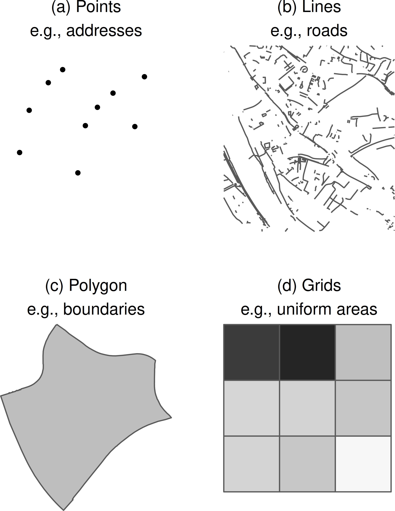
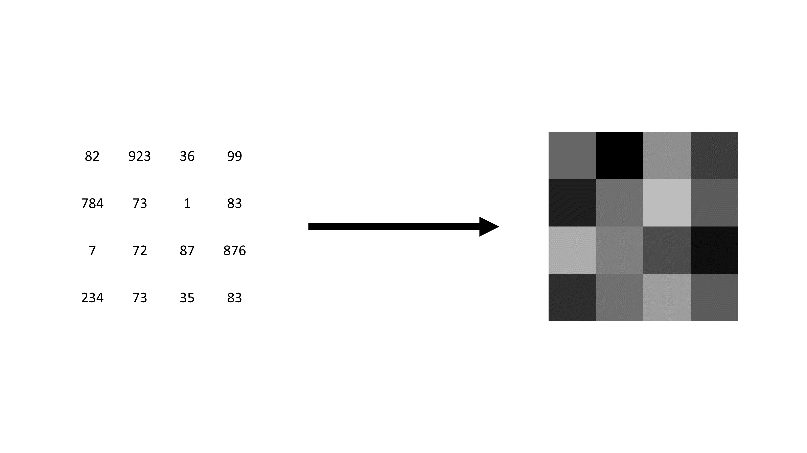
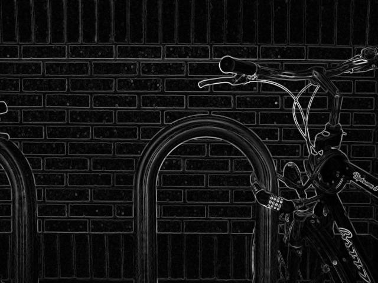
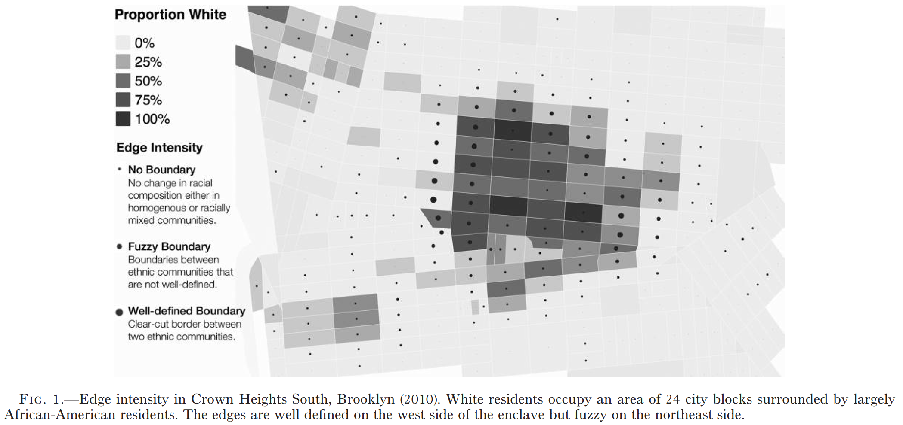
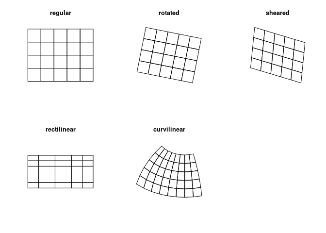

layout: true

```{r init-chunk, include = FALSE}
# load all packages
source("../../R/load_packages.R")

opts_chunk$set(echo = TRUE, fig.align = "center", message = FALSE, cache = TRUE)

# load course content table
source("../../R/course_content.R")

options(warn = -1)

xaringanExtra::use_xaringan_extra(c("tile_view", "clipboard"))
xaringanExtra::use_extra_styles(
  hover_code_line = TRUE,         #<<
  mute_unhighlighted_code = FALSE  #<<
)
```

---

## Now

```{r course-content-now, echo = FALSE}
course_content %>%
  kableExtra::row_spec(4, background = "yellow")
```

---

## `R`-Packages *we* will use

- `raster` 
  - still the major work horse for raster data
  - there's a succesor: `terra` package, but it's still in devolpment
- `stars`
  - interface to modern geospatial data implementations, most and foremost from `sf`
  - package for spatiotemporal datacubes and non-regular raster grids (more on that at the end of session)
  - we will use it only as supportive package for specific purposes

---

## General Difference to Vector Data

Data Structure:
- Other data format(s)
- geometries do not differ within one dataset
- sometimes smaller, sometimes larger in size...


Implications:
- Other geospatial operations possible
- can be way more efficient

Benefits:
- straightforward processing of raster values and extraction of zonal statistics
- it's like working with simple tabular data

---

## Visual Difference between vector and raster data

```{r pic-geometries-1, echo = FALSE, out.width = "40%"}

```

---

## Okay, what exactly are Raster Data?

- Hold information on (most of the time) evenly shaped grid cells
- Basically a simple data table
  - each cell represents one observation
  
```{r fig-from-table-to-raster, echo = FALSE}

```
  
---

## Metadata

- Information about geometries are stored globally as they are the same for all observation
  - their location in space is defined by their cell location in the data table
- Without these information raster data are simple image files

---

## Important Metadata

- Raster Dimensions
  - number of columns, rows, and cells
- Extent
  - Similar to bounding box in vector data
- Resolution
  - size of each raster cell
- Coordinate reference system
  - defines where on earth's surface the raster layer lies

---

## All Beginnings are... easy!

```{r create-empty-raster}
raster::raster()
```

---

## Feed with Data

```{r fill-raster}
input_data <- 
  sample(1:100, 16) %>% 
  matrix(nrow = 4)

raster_layer <- raster::raster(input_data)

raster_layer
```

---

## Plotting

```{r plot-raster}
raster::plot(raster_layer)
```

---

## File formats

- Gtiff/GeoTiff
- JPEG2000
- ...
- .grd
- netCDF
- ...
- sometimes raster data come even in a text format, such as CSV

**In this course, we will only use `tiff` files as it is pretty common. Just be aware that there a different formats out there.**

---

## Implementations in `R`

Again, `raster` is the most commonly used package for raster data in `R`.

There are some newer developments, e.g., as in the `stars` package, implementing also an interface to simple features in `sf`.

The `terra` package helps in using more elaborate zonal statistics, the same holds true for the `spatstat` package.


---

class: middle
## Basic raster operations

---

## Loading raster tifs (Census Data)

```{r immigrants-cologne}
immigrants_cologne <-
  raster::raster("../../data/immigrants_cologne.tif")

inhabitants_cologne <-
  raster::raster("../../data/inhabitants_cologne.tif")

immigrants_cologne
inhabitants_cologne
```

---

## Compare Layers by Plotting

.pull-left[
```{r plot-immigrants}
raster::plot(immigrants_cologne)
```
]

.pull-right[
```{r plot-inhabitants}
raster::plot(inhabitants_cologne)
```
]

---

## btw: We can also use `tmap`

.pull-left[
```{r plot-immigrants-tmap}
tm_shape(immigrants_cologne) +
  tm_raster()
```
]

.pull-right[
```{r plot-inhabitants-tmap}
tm_shape(inhabitants_cologne) +
  tm_raster()
```
]

---

## Preparing for analysis / Base `R` functionalities

```{r preparing-for-analysis}
immigrants_cologne[immigrants_cologne == -9] <- NA
inhabitants_cologne[inhabitants_cologne == -9] <- NA

immigrants_cologne
inhabitants_cologne
```

---

## Simple statistics

Working with raster data is straightforward
- quite speedy
- yet not as comfortable as working with `sf` objects

For example, to calculate the mean we would use:

```{r cellstats-mean}
raster::cellStats(immigrants_cologne, stat = "mean")
```

---

## Get all values as vector

We can also extract the values of a raster directly as vector:

```{r raster-values}
all_raster_values <- raster::values(immigrants_cologne)

mean(all_raster_values, na.rm = TRUE)
```

Nevertheless, although raster are simple data tables, working with them is a bit different in comparison to, e.g., simple features.

---

## Combining raster layers to calculate new values

.pull-left[
```{r combining-raster-layers}
immigrant_rate <-
  immigrants_cologne * 100 / 
  inhabitants_cologne

immigrant_rate
```
]

--

.pull-right[
```{r combined-raster-plot, echo = FALSE}
tm_shape(immigrant_rate) +
  tm_raster()
```
]

---

## 'Subsetting' Raster Layers

We can subsetting vector data by simply filtering for specific attribute values. For example, to subset Cologne's districts only by the one of Deutz we can use the Tidyverse for `sf` data:

.pull-left[
```{r deutz}
deutz <-
  sf::st_read("../../data/cologne.shp") %>% 
  dplyr::filter(NAME == "Deutz")
```
]

.pull-right[
```{r plot-deutz, echo = FALSE}
tm_shape(deutz) +
  tm_borders()
```
]

---

## Cropping

Cropping is a method of cutting out a specifif `slice` of a raster based on an input dataset or geospatial extent, such as a bounding box.

--

.pull-left[
```{r crop-raster}
cropped_immigrant_rate <-
  raster::crop(immigrant_rate, deutz)
```
]

--

.pull-right[
```{r crop-raster-map, echo = FALSE}
tm_shape(cropped_immigrant_rate) +
  tm_raster()
```
]

---

## Masking

Masking is similar to cropping, yet values outside the extent just get set to missing values (`NA`).

--

.pull-left[
```{r mask-raster}
masked_immigrant_rate <-
  raster::mask(immigrant_rate, deutz)
```
]

--

.pull-right[
```{r mask-raster-map, echo = FALSE}
tm_shape(masked_immigrant_rate) +
  tm_raster()
```
]


---

class: middle
## Exercise 1_4_1: Basic Raster Operations

[Exercise](https://stefanjuenger.github.io/gesis-workshop-geospatial-techniques-R/exercises/1_4_1_Basic_Raster_Operations_question.html)

[Solution](https://stefanjuenger.github.io/gesis-workshop-geospatial-techniques-R/exercises/1_4_1_Basic_Raster_Operations_solution.html)

---

class: middle
## Raster Extraction / Zonal statistics

---

## Sampling of some points

.pull-left[
```{r fancy-points}
fancy_points <-
  immigrants_cologne %>% 
  stars::st_as_stars() %>% 
  sf::st_as_sf() %>% 
  sf::st_sample(10) %>% 
  sf::st_as_sf()
```
]

--

.pull-right[
```{r plot-fancy-points}
plot(fancy_points)
```
]

---

## Extract Information from Rasters

.pull-left[
Raster data are useful when we aim to
- apply calculations that are the same for all geometries in the dataset
- **extract information from raster fast and efficient**
]

.pull-right[
```{r plot-raster-extraction}
tm_shape(immigrant_rate) +
  tm_raster() +
  tm_shape(fancy_points) +
  tm_dots(size = .25) 
```
]


---

## Raster Extraction

To extract the raster values at a specific point by location we simply use:

```{r raster-extraction}
raster::extract(immigrants_cologne, fancy_points)
```

---

## Add results to existing dataset (more on that Tomorrow)

These information can simply be added to an existing dataset (our points in this example):

```{r add-results}
fancy_points <-
  fancy_points %>% 
  dplyr::bind_cols(
    immigrant_rate_value = raster::extract(immigrant_rate, .)
  )

fancy_points
```


---

## More elaborated: Spatial Buffers

.pull-left[
Sometimes extracting information 1:1 is not enough
- too narrow
- missing information about the surrounding of a point in space
]

.pull-right[
```{r plot-buffer-extraction, out.width = "75%"}
tm_shape(immigrants_cologne) +
  tm_raster() +
  tm_shape(
    fancy_points %>% 
      sf::st_buffer(500)
  ) +
  tm_dots(size = .1) +
  tm_borders()
```
]

---

## Buffer Extraction

Wa can use spatial buffers of different sizes to extract information on surroundings:

```{r raster-buffer-extraction}
raster::extract(
  immigrants_cologne, 
  fancy_points, 
  buffer = 500,
  fun = mean
  )
```

---

## Focal statistics

Focal statistics are another method of include information in proximity of a point in space. However, it's applied to the whole dataset and is independent from arbitrary points we project onto a map.
- relates focal cells to surrounding cells
- vastly used in image processing
- but also applicable in social science research as we will see

---

## Focal Application: Edge Detection

.pull-left[
```{r edge-plain, echo = FALSE}
knitr::include_graphics("./img/Bikesgray.jpg")
```
]

.pull-right[
```{r edge-sobel, echo = FALSE}

```
]

.tinyisher[Source: https://en.wikipedia.org/wiki/Sobel_operator]

---

## Edges of Immigrant Rates

```{r legewie-schaeffer, echo = FALSE}

```

---

## We can do that as well using a Sobel filter

$$r_x = \begin{bmatrix}1 & 0 & -1 \\2 & 0 & -2 \\1 & 0 & -1\end{bmatrix} \times raster\_file \\r_y = \begin{bmatrix}1 & 2 & 1 \\0 & 0 & 0 \\-1 & -2 & -1\end{bmatrix}\times raster\_file \\r_{xy} = \sqrt{r_{x}^2 + r_{y}^2}$$

---

## Implementation in R

From the [official documentation](http://search.r-project.org/R/library/raster/html/focal.html):

```{r sobel-function}
sobel <- function(r) {
  fy <- matrix(c(1, 0, -1, 2, 0, -2, 1, 0, -1), nrow = 3)
  fx <- matrix(c(-1, -2, -1, 0, 0, 0, 1, 2, 1) , nrow = 3)
  rx <- focal(r, fx)
  ry <- focal(r, fy)
  sqrt(rx^2 + ry^2)
}
```

---

## Data Preparation and Application of Filter

```{r data-prep-filter}
old_extent <- raster::extent(immigrant_rate) 
new_extent <- old_extent + c(10000, -10000, 10000, -10000)

smaller_immigrant_rate <-
  immigrant_rate %>% 
  raster::crop(new_extent)

smaller_immigrant_rate[smaller_immigrant_rate < 15] <- NA

immigrant_edges <-
  sobel(smaller_immigrant_rate)
```

---

## Comparison

.pull-left[
```{r original-image, echo = FALSE}
tm_shape(smaller_immigrant_rate) +
  tm_raster(palette = "Greys")
```
]

--

.pull-right[
```{r sobel-image, echo = FALSE}
tm_shape(immigrant_edges) +
  tm_raster(palette = "Greys")
```
]

---

## Raster stacks (or `raster::brick()`, respectively)

So far, raster have been unidimensional: we only had one attribute for each dataset.

But they can also be stacked:
```{r raster-stack}
census_stack <-
  raster::stack(immigrants_cologne, inhabitants_cologne)

census_stack
```

---

## Multi-band rasters

.pull-left[
```{r rg-layer}
germans_cologne <-
  raster::raster(
    "../../data/germans_cologne.tif"
  )

census_rg <-
  raster::stack(
    germans_cologne,
    immigrants_cologne
  )
```
]

.pull-right[
```{r rg-layer-plot, out.width = "75%"}
raster::plotRGB(
  census_rg, 
  scale = 639, 
  stretch = "lin"
)
```
]

---

class: middle
## Exercise 1_4_2: : Fancier Raster Operations

[Exercise](https://stefanjuenger.github.io/gesis-workshop-geospatial-techniques-R/exercises/1_4_2_Fancier_Raster_Operations_question.html)

[Solution](https://stefanjuenger.github.io/gesis-workshop-geospatial-techniques-R/exercises/1_4_2_Fancier_Raster_Operations_solution.html)

---

class: middle
## Conversion and possible applications

---

## Raster to Points

```{r raster-to-points}
raster_points <-
  raster::rasterToPoints(immigrant_rate, spatial = TRUE) %>% 
  sf::st_as_sf()

raster_points
```


---

## Points to Raster

```{r points-to-raster}
points_raster <-
  raster_points %>% 
  sf::st_coordinates() %>% 
  dplyr::bind_cols(Z = raster_points$layer) %>% 
  raster::rasterFromXYZ(crs = 3035)

points_raster
```


---

## Application: Point Pattern Analysis using Global Kernel Densities ('Heatmap')

.pull-left[
```{r simple-densities}
kernel_densities <- 
  raster_points %>% 
  dplyr::filter(layer > 25) %>% 
  sf::as_Spatial() %>%
  as("ppp") %>% 
  spatstat::density.ppp(sigma = 250) %>% 
  as.data.frame() %>%
  raster::rasterFromXYZ(crs = 3035)
```
]

.pull-right[
```{r plot-densities, echo = FALSE}
tm_shape(kernel_densities) +
  tm_raster()
```
]

---

## Raster to Polygons

.pull-left[
```{r raster-to-polygon}
polygon_raster <-
  immigrant_rate %>% 
  raster::rasterToPolygons() %>% 
  sf::st_as_sf()
```
]

.pull-right[
```{r plot-polygon-raster, echo = FALSE}
tm_shape(polygon_raster) +
  tm_polygons()
```
]

---

## Application: Rotation in Space (Tomorrow's Session)

```{r fun-rotate-data, include = FALSE}
rotate_data <- function(data, x_add = 0, y_add = 0) {
  
  shear_matrix <- function () { 
    matrix(c(2, 1.2, 0, 1), 2, 2) 
  }
  
  rotate_matrix <- function(x) { 
    matrix(c(cos(x), sin(x), -sin(x), cos(x)), 2, 2) 
  }
  
  data %>% 
    dplyr::mutate(
      geometry = 
        .$geometry * shear_matrix() * rotate_matrix(pi/20) + c(x_add, y_add)
    )
}
```

```{r plot-polygon-raster-rotated, echo = FALSE}
ggplot() +
  geom_sf(data = rotate_data(polygon_raster)) +
  ggsn::blank()
```

---

## Rasterize using the `stars` package

In the `raster` (or `terra`) package are functions to convert vector data into raster data, a process called rasterizing. I find these function a bit tricky as they require defining a 'background' raster layer on which the vector data are projected. Thus, I prefer the following method using the `stars` package:

```{r polygon-to-raster}
raster_polygon <-
  polygon_raster %>% 
  stars::st_rasterize(dx = 100, dy = 100) %>% 
  as("Raster")
```

---

## `raster`'s successor: the `terra` package

`R` and its packages are in continuous development. 
- functions change
- new packages appear
- old packages get deprecated

--

The developers of the `raster` package decided to rewrite the functions so that it's [simpler, better, and faster](https://rspatial.org/terra/pkg/index.html)

**Thus, `terra` will be the successor of the `raster` package in the future.**

---

## Non-regular grids

In this course, we will only use regular grid-based raster data. But be aware that also non-regular grid data exist.

```{r pic-grid, echo = FALSE, out.width = "80%"}

```

.tinyisher[Source: https://r-spatial.github.io/stars/]

---

class: middle
## Break

---

layout: false
class: center
background-image: url(./img/the_end.png)
background-size: cover

.left-column[
</br>
```{r pic-me, echo = FALSE, out.width = "90%"}
knitr::include_graphics("./img/stefan.png")
```
]

.right-column[
.left[.small[`r icon::fontawesome("envelope")` [`stefan.juenger@gesis.org`](mailto:cute.cat@gesis.org)] </br>
.small[`r icon::fontawesome("twitter")` [`@StefanJuenger`](https://twitter.com/CuteCat)] </br>
.small[`r icon::fontawesome("github")` [`StefanJuenger`](https://github.com/cute_cat)] </br>
.small[`r icon::fontawesome("home")` [`https://stefanjuenger.github.io`](https://www.cute-cat.org)]] </br>
]