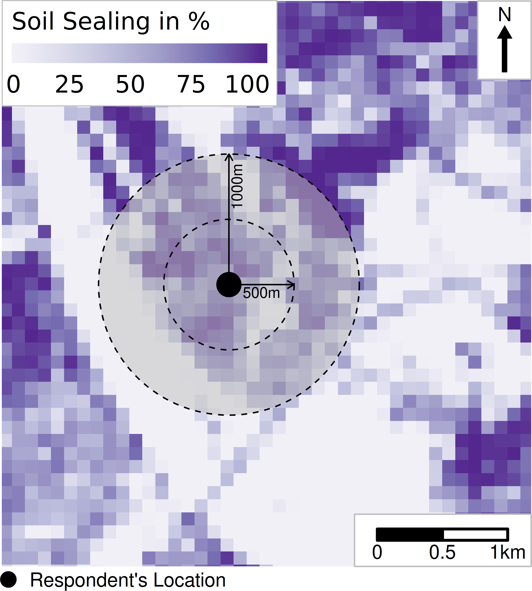

layout: true

```{r init-chunk, include = FALSE}
# load all packages
source("../../R/load_packages.R")

opts_chunk$set(echo = TRUE, fig.align = "center", message = FALSE, cache = TRUE)

# load course content table
source("../../R/course_content.R")

options(warn = -1)

xaringanExtra::use_xaringan_extra(c("tile_view", "clipboard"))
xaringanExtra::use_extra_styles(
  hover_code_line = TRUE,         #<<
  mute_unhighlighted_code = FALSE  #<<
)
```

---

## Now

```{r course-content-now, echo = FALSE}
course_content %>%
  kableExtra::row_spec(6, background = "yellow")
```

---

## `R`-Packages *We* Will Use

- `osmdata` 
- `tmaptools`
- `reticulate`
- `StefanJuenger/z11`

---

## More on the Geospatial Data Landscape

Geospatial data tend to be quite big
- pressure to distribute data efficiently

Data dumps (on the internet) may not be helpful when resources are low and/or time's a factor.

Already for a long time, there are standards to distribute data over the internet and make accessing only chunks of them possible
- Use of *Programming Application Interfaces* (API)

---

## What Is an API?

An Application Programming Interface (API) serves as an entry point to data distributed over the internet to
- get data
- push data

Standardized mechanisms
- to query data
- often just a simple text string to enter in your URL-address bar
- it gets complicated when login data are required

---

## Data Providers Offering Geospatial Data APIs

- [OpenStreetMap](https://wiki.openstreetmap.org/wiki/API)
- [Google](https://developers.google.com/maps/documentation/geolocation/overview)
- [Bing](https://docs.microsoft.com/en-us/bingmaps/rest-services/locations/)
- ...
- [Cologne's Open Data Portal](https://www.offenedaten-koeln.de/dataset/taxonomy/term/44/field_tags/Geo-44)
- Specialized `R` packages, such as the [`wiesbaden` package](https://cran.r-project.org/web/packages/wiesbaden/index.html) or the [`tidycensus` package](https://cran.r-project.org/web/packages/tidycensus/index.html)

---

## How Are Data Accessed?

1. (What is there to get?
2. (Can I get it?)
3. Specify what I can get
3. Get it!

---

## Example: Access to Public Transport

Say, we're interested in the accessibility of public transport in Cologne
- bus, tram, etc.
- all platforms and vehicles should be wheel-chair accessible

**We can gather this information using OpenStreetMap!**

---

## Accessing OSM Data: The Overpass API

> The Overpass API (formerly known as OSM Server Side Scripting, or OSM3S before 2011) is a read-only API that serves up custom selected parts of the OSM map data. It acts as a database over the web: the client sends a query to the API and returns the data set that corresponds to the query.

.tinyisher[Source: https://wiki.openstreetmap.org/wiki/Overpass_API]

---

## Starting With a Geographic Area to Query

Many geospatial API requests start with a bounding box or another geographical extent to define which area should be accessed.

.pull-left[
```{r cologne-polygon}
cologne_pt_stops <-
  osmdata::getbb(
    "Köln", 
    format_out = "sf_polygon"
  )
```
]

--

.pull-right[
```{r cologne-polygon-plot, echo = FALSE}
tm_shape(cologne_pt_stops) +
  tm_polygons()
```
]

---

## Defining Some Technical Details

The Overpass API also requires a timeout parameter that repeats the request a certain amount of time if anything fails.

```{r cologne-opq}
cologne_pt_stops <-
  cologne_pt_stops %>% 
  osmdata::opq(timeout = 25*100)

cologne_pt_stops
```

---

## Turning to the Content

The content which we aim to request is defined with key/value pairs. It's best to learn them by doing and look them up in the [official documentation](https://wiki.openstreetmap.org/wiki/Map_features).

```{r cologne-features}
cologne_pt_stops <-
  cologne_pt_stops %>%    
  osmdata::add_osm_feature(key = "public_transport", value = "stop_position")

cologne_pt_stops
```

---

## Conduct Actual Request/Download

In the `osmdata` package, data is actually downloaded, e.g., by using the `osmdata::osmdata_sf()` function.

```{r osmdata-download}
cologne_pt_stops <-
  cologne_pt_stops %>%   
  osmdata::osmdata_sf()

cologne_pt_stops
```

---

## Filter and Transform

The data comprises a list that can be accessed as any list in `R`. Here we extract the points and wrangle them spatially.

.pull-left[
```{r osmdata-filter-transform}
cologne_pt_stops <-
  cologne_pt_stops %>% 
  .$osm_points %>% 
  tibble::as_tibble() %>% 
  sf::st_as_sf() %>% 
  sf::st_transform(3035) %>% 
  dplyr::filter(wheelchair == "yes")

cologne_pt_stops
```
]

---

## The Data Indeed Are Mappable

.pull-left[
```{r cologne-pt-stops-map, eval = FALSE}
tm_shape(cologne_pt_stops) +
  tm_dots()
```
]

--

.pull-right[
```{r cologne-pt-stops-map, ref.label = "cologne-pt-stops-map", echo = FALSE}
```
]

---

## Fiddling With the Data: Creating a Quick 'Heatmap'

OpenStreetMap points data are nice to analyze urban infrastructure. Let's draw a quick 'heatmap' using kernel densities.

.pull-left[
```{r cologne-pt-stops-densities}
cologne_pt_stops_densities <- 
  cologne_pt_stops %>% 
  sf::as_Spatial() %>%
  as("ppp") %>% 
  spatstat::density.ppp(sigma = 500) %>% 
  as.data.frame() %>%
  raster::rasterFromXYZ(crs = 3035)
  
```
]

--

.pull-right[
```{r cologne-pt-stops-densities-plot, echo = FALSE}
tm_shape(cologne_pt_stops_densities) +
  tm_raster(midpoint = NA)
```
]

---

class: middle
## Exercise 2_1_1: Working with OSM Data

[Exercise](https://stefanjuenger.github.io/gesis-workshop-geospatial-techniques-R/exercises/2_1_1_Working_with_OSM_data_question.html)

[Solution](https://stefanjuenger.github.io/gesis-workshop-geospatial-techniques-R/solutions/2_1_1_Working_with_OSM_data_solution.html)

---

## Accessing Unpackaged (Vector) Data

Not all data come as pretty as OpenStreetMap data in, e.g., the `osmdata` package.

Don't worry. There are methods to import data from source that
- only provide an URL
- not yet prepared for analysis


---

## Example: GeoJSON Files

JSON files are pretty popular
- standardized and well structured
- similar to XML-files, but human readability is a bit better
- also easy to parse for editors and browser

There's also a JSON flavor for geospatial data...

---

## GeoJSON Snippet

```
{
  "type": "FeatureCollection",
  "features": [
    {
      "type": "Feature",
      "id": 12,
      "geometry": {
        "type": "Polygon",
        "coordinates": [
          [
            [
              6.957362270020273,
              50.94308762750329
            ]   
  ...
```

.tinyisher[Source: https://www.offenedaten-koeln.de/]

---

## An Application From Cologne’s Open Data Portal

```{r where-to-wear}
where_to_wear <-
  glue::glue(
    "https://geoportal.stadt-koeln.de/arcgis/rest/services/\\
    Politik_und_Verwaltung/maskenpflicht/MapServer/0/query?\\
    where=id+is+not+null&text=&objectIds=&time=&geometry=&geometryType=\\
    esriGeometryEnvelope&inSR=&spatialRel=esriSpatialRelIntersects&distance=\\
    &units=esriSRUnit_Foot&relationParam=&outFields=*&returnGeometry=true&\\
    returnTrueCurves=false&maxAllowableOffset=&geometryPrecision=&outSR=4326&\\
    havingClause=&returnIdsOnly=false&returnCountOnly=false&orderByFields=&\\
    groupByFieldsForStatistics=&outStatistics=&returnZ=false&returnM=false&\\
    gdbVersion=&historicMoment=&returnDistinctValues=false&resultOffset=&\\
    resultRecordCount=&returnExtentOnly=false&datumTransformation=&\\
    parameterValues=&rangeValues=&quantizationParameters=&featureEncoding=\\
    esriDefault&f=geojson"
  ) %>% 
  sf::st_read(as_tibble = TRUE)
```

.tinyisher[Source: https://www.offenedaten-koeln.de/]

---

## Where to Wear a Mask

We now know where in Cologne you should wear a mask using `R`. Not too bad, right?

.pull-left[
```{r where-to-wear-plot, eval = FALSE}
tm_shape(where_to_wear) +
  tm_polygons(col = "red", alpha = .75)
```
]

--

.pull-right[
```{r where-to-wear-plot-exec, ref.label = "where-to-wear-plot", echo = FALSE}
```
]

---

## Raster Data Access

APIs are not only used for vector data but also raster data.

The idea is the same
- accessing the information through URLs
- just the downloaded data formats differ

---

## OSM Data Can Be Gathered As Raster Data, Too

The `tmaptools` package is pretty handy to download OpenStreetMap data (tiles).

```{r cologne-raster}
cologne_raster <-
  tmaptools::read_osm(where_to_wear) %>% # it's a stars object
  as("Raster")

cologne_raster
```

---

## Mapped OSM Raster Data

The resulting data can be packed in a `tmap` workflow.

.pull-left[
```{r cologne-raster-map, eval = FALSE}
tm_shape(cologne_raster) +
  tm_rgb()
```
]

--

.pull-right[
```{r cologne-raster-map-exec, ref.label = "cologne-raster-map", echo = FALSE}
```
]

---

## Use It As a Background Map

As these data are images, they are perfect to be used as background maps when mapping other geospatial attributes, such as our mask-wearing data.

.pull-left[
```{r cologne-raster-map-bg, eval = FALSE}
tm_shape(cologne_raster) +
  tm_rgb() +
  tm_shape(where_to_wear) +
  tm_polygons(col = "red", alpha = .75)
```
]

--

.pull-right[
```{r cologne-raster-map-bg-exec, ref.label = "cologne-raster-map-bg", echo = FALSE}
```
]

---

## Playing With Different Map Types

List of available type names can be seen with the function call `OpenStreetMap::getMapInfo()`.

--

.pull-left[
```{r esri-topo, out.width = "70%"}
tmaptools::read_osm(
  where_to_wear, 
  type = "esri-topo"
) %>% 
  tm_shape() +
  tm_rgb() +
  tm_shape(where_to_wear) +
  tm_polygons(col = "red", alpha = .75)
```
]

--

.pull-right[
```{r stamen-watercolor, out.width = "70%"}
tmaptools::read_osm(
  where_to_wear, 
  type = "stamen-watercolor"
) %>% 
  tm_shape() +
  tm_rgb() +
  tm_shape(where_to_wear) +
  tm_polygons(col = "red", alpha = .75)
```
]

---

## OGC Web Services

OSM and others provide their standardized interface to their data.

The Open Geospatial Consortium developed a more broadly used interface design for more diverse data sources
- often used by public authorities all over the world
- support of well-supported data formats
- good documentation

---

## Displaying vs. Downloading

These web services can broadly be divided into services to
- display data
- download data

Let's briefly focus on download services!

---

## Download Services

Web Feature Service (WFS)
- vector data

**Web Coverage Service (WCS)**
- raster data

Unfortunately, as of today, no ready-to-play packages are providing full access to OWS services in `R`
- The [`ows4R` package](https://cran.r-project.org/web/packages/ows4R/index.html) lets you only use WFS services
- I (Stefan), however, work a lot with raster data

In the following, we will establish an interface to `Python` and use its `OWSLib` to access WCS data.

---

## Monitor of Settlement and Open Space Development (IOER Monitor)

.pull-left[
The Leibniz Institute of Ecological Urban and Regional Development provides the [Monitor of Settlement and Open Space Development (IOER Monitor)](https://www.ioer-monitor.de/en/)
- information on land use in Germany
- over time
- small scale raster resolutions available (min: 100m $\times$ 100m)
]

.pull-right[
```{r sealing-buffer, echo = FALSE, out.width = "75%"}

```
]

---

## Function Accessing Python's `OWSLib`

.pull-left[
.mini[
```{r fun-ioer-layer-p1 , eval = FALSE}
#' Retrieve Raster Layer from the IOER Monitor
#' Download raster layer from the Monitor of Settlement and Open Space
#' Development (IOER Monitor) and load it in your R session.
#'
#' @param indicator_key character string; indicator key as defined here:
#' \url{https://www.ioer-monitor.de/en/indicators/}
#' @param size character string; combination of size and unit, e.g.,
#' \code{"500m"}. ATTENTION: sizes below 200m are currently not working :-(
#' @param year character string; reference year for the indicator. ATTENTION:
#' not all indicators are available for any year
#' @param tmp_folder character string; path where the downloaded and temporary
#' file should be stored to reload as raster layer
#'
#' @importFrom magrittr %>%
#' @importFrom reticulate %as%

download_ioer_layer <-
  function (
    indicator_key = "S08RG",
    size = "500m",
    year = "2019",
    tmp_folder = "."
  ) {

    # create interface to python
    py <- reticulate::import_builtins()

    # build web coverage service request
    indicator_wcs <-
      paste0("http://maps.ioer.de/cgi-bin/wcs?MAP=", indicator_key, "_wcs") %>%
      reticulate::import("owslib.wcs")$WebCoverageService(., version = '1.0.0')

    # retrieve layer name
    layer_name <-
      indicator_wcs$contents %>%
      names() %>%
      grep(year, ., value = TRUE) %>%
      grep(size, ., value = TRUE)

    # identify the actual layer to download, ...
    layer_to_download <-
      layer_name %>%
      indicator_wcs[.]

    # ...its resolution, ...
    layer_resolution <-
      layer_to_download %>%
      .$grid %>%
      .$highlimits %>%
      as.numeric()
    
    ...
```
]
]

.pull-right[
.mini[
```{r fun-ioer-layer-p2, eval = FALSE}
    ... 
   
    # ...its native coordinate reference system, ...
    layer_native_crs <-
      layer_to_download %>%
      .$boundingboxes %>%
      .[2] %>%
      .[[1]] %>%
      .$nativeSrs

    # ...and its bounding box
    layer_bounding_box <-
      layer_to_download %>%
      .$boundingboxes %>%
      .[2] %>%
      .[[1]] %>%
      .$bbox %>%
      unlist()

    # download layer
    downloaded_layer <-
      indicator_wcs$getCoverage(
        identifier = layer_name,
        bbox = layer_bounding_box,
        format = "GTiff",
        crs = layer_native_crs,
        width = layer_resolution[1],
        height = layer_resolution[2]
      )  %>%
      .$read %>%
      reticulate::py_call(.)

    # store tmp file
    with(py$open(
      paste0(tmp_folder, '/layer.tif'), "wb") %as% file, {
        file$write(downloaded_layer)
      }
    )

    # load tmp file as 'native' r raster file
    raster_layer <-
      raster::raster(paste0(tmp_folder, '/layer.tif'))

    raster_layer <- raster::readAll(raster_layer)

    # delete tmp file
    unlink(paste0(tmp_folder, '/layer.tif'))

    # return raster layer
    raster_layer
  }
```
]
]

---

## Green Spaces

We can use this function, e.g., for downloading the green space distribution in Cologne.

.pull-left[
```{r load-ioer-green}
source("../../R/download_ioer_layer.R")

cologne <- 
  osmdata::getbb(
    "Köln", 
    format_out = "sf_polygon"
  ) %>% 
  sf::st_transform(3035)

cologne_green <-
  download_ioer_layer(
    indicator_key = "S08RG",
    size = "500m",
    year = "2019",
    tmp_folder = "."
  ) %>% 
  raster::crop(cologne) %>% 
  { mannheim_green_for_linking <<- . } %>% 
  raster::rasterToPolygons() %>% 
  sf::st_as_sf() %>% 
  sf::st_transform(3035) %>% 
  sf::st_intersection(cologne)
```
]

--

.pull-right[
```{r map-ioer-green, eval = FALSE}
tm_shape(cologne_green) +
  tm_polygons("layer", palette = "Greens")
```

```{r map-ioer-green-execution, ref.label = "map-ioer-green", echo = FALSE}
```
]

---

## Shameless Advertising: The `z11` Package

There are times where no APIs are available for downloading geospatial data.

The German Census 2011 is a prime example
- only a data dump of Gigabytes of data exists for hundreds of attributes
- when you often work with these data, it's a pain

**Thus, I created my own (pseudo-)API for these data hosted over Github.**

---

## Accessing Data

Details on using the package can be found [here](https://stefanjuenger.github.io/z11/articles/using-z11.html), but it's straightforward to use. For example, if you want to download data on immigrant rates on a 1 km² grid, you can use the following function.

```{r census-immigrants}
immigrants_germany <-
  z11::z11_get_1km_attribute(Auslaender_A)

immigrants_germany[immigrants_germany <= -1] <- NA

immigrants_germany
```

---

## It’s a Raster

As it is a raster file, you can plot it easily.

--

.pull-left[
```{r census-immigrants-map, eval = FALSE}
tm_shape(immigrants_germany) +
  tm_raster(palette = "viridis")
```
]

--

.pull-right[
```{r census-immigrants-map-execution, ref.label = "census-immigrants-map", echo = FALSE}
```
]

---

class: middle 
## Exercise 2_1_2: Wrangling the German Census

[Exercise](https://stefanjuenger.github.io/gesis-workshop-geospatial-techniques-R/exercises/2_1_2_Wrangling_the_German_Census_question.html)

[Solution](https://stefanjuenger.github.io/gesis-workshop-geospatial-techniques-R/solutions/2_1_2_Wrangling_the_German_Census_solution.html)

---

class: middle
## Break `r emo::ji("hot_beverage")`

---

layout: false
class: center
background-image: url(./assets/img/the_end.png)
background-size: cover

.left-column[
</br>
```{r pic-me, echo = FALSE, out.width = "90%"}
knitr::include_graphics("./img/stefan.png")
```
]

.right-column[
.left[.small[`r icon::fontawesome("envelope")` [`stefan.juenger@gesis.org`](mailto:stefan.juenger@gesis.org)] </br>
.small[`r icon::fontawesome("twitter")` [`@StefanJuenger`](https://twitter.com/StefanJuenger)] </br>
.small[`r icon::fontawesome("github")` [`StefanJuenger`](https://github.com/StefanJuenger)] </br>
.small[`r icon::fontawesome("home")` [`https://stefanjuenger.github.io`](https://stefanjuenger.github.io)]] </br>
]