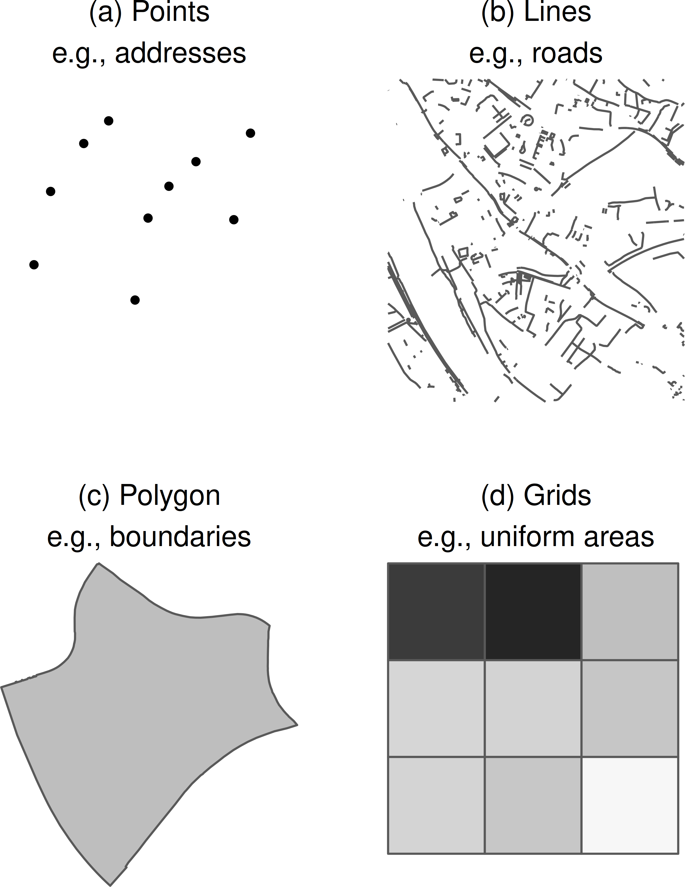
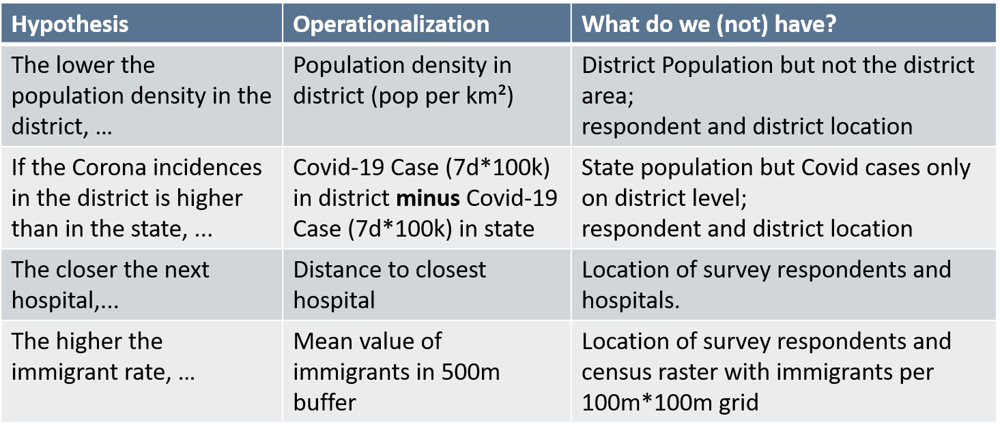

layout: true

```{r init-chunk, include = FALSE}
# load all packages
source("../../R/load_packages.R")

opts_chunk$set(echo = TRUE, fig.align = "center", message = FALSE, cache = TRUE)

# load course content table
source("../../R/course_content.R")

options(warn = -1)

xaringanExtra::use_xaringan_extra(c("tile_view", "clipboard"))
xaringanExtra::use_extra_styles(
  hover_code_line = TRUE,         #<<
  mute_unhighlighted_code = FALSE  #<<
)
```

---

## Now

```{r course-content-now, echo = FALSE}
course_content %>%
  kableExtra::row_spec(7, background = "yellow")
```

---

## What Are Georeferenced Data?

.pull-left[
</br>
Data with a direct spatial reference $\rightarrow$ **geo-coordinates**
- Information about geometries
- Optional: Content in relation to the geometries
]

.pull-right[
```{r pic-geometries-1, echo = FALSE, out.width="85%"}

```

.tinyisher[Sources: OpenStreetMap / GEOFABRIK (2018), City of Cologne (2014), and the Statistical Offices of the Federation and the Länder (2016) / Jünger, 2019]
]

---


## Georeferenced Survey Data

Survey data enriched with geo-coordinates (or other direct spatial references)

</br>

```{r pic-surveys, echo = FALSE, out.width="85%"}

```

</br>

.center[**With georeferenced survey data, we can analyze interactions between individual behaviors and attitudes and the environment.**]

---

## Prerequisite: Geocoding

.pull-left[
Indirect spatial references have to be converted into direct spatial references
$\rightarrow$ Addresses to geo-coordinates

Different service providers can be used
- e.g., Google, Bing, OSM
- In Germany: Federal Agency of Cartography and Geodesy (BKG)
]

.pull-right[
</br>
</br>
```{r pic-geocoding, echo = FALSE}

```
]

---

## Georeferenced Survey Data $\neq$ Geospatial Data

.pull-left[
We must not store geo-coordinates and survey data in one dataset
- Differences to geospatial data
- More complicated workflow to work with (see Challenges)
]

.pull-right[
```{r pic-linking-workflow, echo = FALSE, out.width="85%"}

```

.right[.tinyisher[Jünger, 2019]]
]

---

## Data Availability

.pull-left[
Geospatial Data
- Often de-centralized distributed 
- Fragmented data landscape, at least in Germany

Georeferenced Survey Data
- Primarily, survey data
- Depends on documentation
- Access difficult due to data protection restrictions
]

.pull-right[
```{r pic-data-availability, echo = FALSE, out.width = "75%"}

```
.right[.tinyisher[
https://www.eea.europa.eu/data-and-maps
https://datasearch.gesis.org/
https://datasetsearch.research.google.com/
]]
]

---

## Technical Procedures

.pull-left[
</br>
.center[]
.center[.tinyisher[https://giphy.com/gifs/VbnUQpnihPSIgIXuZv]]
]


.pull-right[
Geocoding
- Reasonable automated procedure
- But differ in quality and access rights
- High risk for data protection

GIS procedures
- Requires exploiting specialized software
- Can get complex and resource-intensive
]

---

## Data Protection

</br>
</br>
That‘s one of the biggest issues
- Explicit spatial references increase the risk of re-identifying anonymized survey respondents
- Can occur during the processing of data but also during the analysis

</br>

.center[**Affects all phases of research and data management!**]

---

## Legal Regulations

.pull-left[
Storing personal information such as addresses in the same place as actual survey attributes is not allowed in Germany
- Projects keep them in separate locations
- Can only be matched with a correspondence table
- Necessary to conduct data linking
]

.pull-right[
```{r pic-linking-2, echo = FALSE}

```

.right[.tinyisher[Jünger, 2019]]
]

---

## Distribution & Re-Identification Risk

Data may still be sensitive
- Geospatial attributes add new information to existing data
- May be part of general data privacy checks, but we may not distribute these data as is

.pull-left[
Safe Rooms / Secure Data Centers
- Control access
- Checks output
]

.pull-right[
```{r pic-safe-room, echo = FALSE}

```
.right[.tinyisher[https://www.gesis.org/en/services/processing-and-analyzing-data/guest-research-stays/secure-data-center-sdc]]
]

---

## Spatial Linking

```{r pic-spatial-linking, echo = FALSE, out.width = "45%"}
 
```

.tinyisher[Sources:  OpenStreetMap / GEOFABRIK (2018), City of Cologne (2014), Leibniz Institute of Ecological Urban and Regional Development (2018), Statistical Offices of the Federation and the Länder (2016), and German Environmental Agency / EIONET Central Data Repository (2016) / Jünger, 2019]

---

## Spatial Linking Methods (Examples) I

.pull-left[

1:1

```{r pic-noise-by-location, echo = FALSE, out.width = "75%"}

```
]

.pull-right[

Distances

```{r pic-noise-distance, echo = FALSE, out.width = "75%"}

```
]

.tinyisher[Sources: German Environmental Agency / EIONET Central Data Repository (2016) and OpenStreetMap / GEOFABRIK (2018) / Jünger, 2019]

---

## Spatial Linking Methods (Examples) II

.pull-left[

Filter methods

```{r pic-immigrants-filter, echo = FALSE, out.width = "75%"}

```

]

.pull-right[

Buffer zones

```{r pic-selaing-buffer, echo = FALSE, out.width = "75%"}
knitr::include_graphics("./img/fig_linking_buffer_sealing.png")
```
]

.tinyisher[Sources: Leibniz Institute of Ecological Urban and Regional Development (2018) and Statistical Offices of the Federation and the Länder (2016) / Jünger, 2019]

---


## Fake Research Question

.pull-left[
Say we're interested in the impact of the current pandemic on individual well-being in the geographic context.

We plan to conduct a survey in the state of North-Rhine Westphalia.
]

.pull-right[
</br>
```{r pic-trump-fake, echo = FALSE}

```
.center[.tinyisher[https://imgflip.com/memegenerator/Trump-Bill-Signing]
]
]

---

## Our Sample Area: NRW’s Boundaries

.pull-left[
```{r get-nrw}
nrw <-
  osmdata::getbb(
    "Nordrhein-Westfalen", 
    format_out = "sf_polygon"
  ) %>% 
  .$multipolygon %>% 
  sf::st_transform(3035) 
```
]

--

.pull-right[
```{r nrw-map}
tm_shape(nrw) +
  tm_borders()
```
]

---

## A Fake-Life Application

.pull-left[
Let's sample 1,000 people to interview them about their lives.

We can draw a fake sample this way and also add an identifier for the respondents:

```{r set-seed}
set.seed(1234)
```


```{r simulate-coordinates}
fake_coordinates <-
  sf::st_sample(nrw, 1000) %>% 
  sf::st_sf() %>% 
  dplyr::mutate(
    id_2 = 
      stringi::stri_rand_strings(
        10000, 
        10
      ) %>% 
      sample(1000, replace = FALSE)
  )
```
]

--

.pull-right[
```{r map-osm-coordinates}
tm_shape(nrw) +
  tm_borders() +
  tm_shape(fake_coordinates) +
  tm_dots()
```
]

---

## Correspondence Table

As in any survey that deals with addresses, we need a correspondence table of the distinct identifiers.

```{r create-correspondence-table}
correspondence_table <-
  dplyr::bind_cols(
    id = 
      stringi::stri_rand_strings(10000, 10) %>% 
      sample(1000, replace = FALSE),
    id_2 = fake_coordinates$id_2
  )

correspondence_table
```

---

## Conduct the Survey

We ask respondents for some standard sociodemographics. But we also apply a new and highly innovative item score, called the Fake Corona Burden Score (FCBS) using the [`faux` package](https://cran.r-project.org/web/packages/faux/index.html).

```{r hidden-data, include = FALSE}
secret_data <- readRDS("../../data/secrect_data.rds")

secret_variable_we_are_hiding_from_you <-
  faux::rnorm_pre(
        secret_data$pop_dens, 
        mu = 50, 
        sd = 10, 
        r = -0.5
      )
```

```{r simulate-survey-data}
fake_survey_data <- 
  dplyr::bind_cols(
    id = correspondence_table$id,
    age = sample(18:100, 1000, replace = TRUE),
    gender = 
      sample(1:2, 1000, replace = TRUE) %>% 
      as.factor(),
    education =
      sample(1:4, 1000, replace = TRUE) %>% 
      as.factor(),
    income =
      sample(100:10000, 1000, replace = TRUE),
    fcbs = secret_variable_we_are_hiding_from_you
  )
```

---

## Survey Data Structure

```{r show-survey-data}
fake_survey_data 
```

---

## What could explain our Fake Corona Burden Score?

*Likelihood to meet people*
> 1) The lower the district's population density, the lower the Fake Corona Burden Score.

--

*District relatively high affected by Covid-19*
> 2) If the Corona 7 day incidence per 100k in the district is higher than in the state, the lower the Fake Corona Burden Score.

--

*Provision of health services*
> 3) The closer the next hospital to the respondent, the lower the Fake Corona Burden Score

---

## Variable Overview

Good Thing: We have all the data to calculate these indicators, even though we need first to transform some of the variables.

  1. Calculate the variables at the district and state-level.
  2. Link the district and state-level data with the fake survey respondents.
  3. Calculate the hospital distance.

```{r overview-table, echo = FALSE, out.width = "90%"}

```

---

## Population Density

When all data sets are loaded, we can calculate the districts' area for the population density. 

<small><small>Remember: We reduced our sample to North Rhine Westphalia and dropped some variables.</small></small>

```{r load-data-hidden, echo = F, warning = F, message = F}

source("../../R/import_shapefiles.R")

nrw_districts_enhanced <-
  german_districts_enhanced %>% 
  filter( district_id >= 5000 & district_id < 6000 ) %>% 
  dplyr::select(., district_id, population, cases_7days)

nrw_enhanced <-
  german_states %>% 
  filter( state_id == "05")

nrw_hospitals <-
  hospitals %>% 
  st_join(., nrw_enhanced, join = st_within) %>% 
  filter(!is.na(state_id))

```

.smaller[
```{r area-calc}

# calculate area of districts
st_area(nrw_districts_enhanced) %>% 
  head(4)

# areas will always be calculated
# in units according to the CRS 
nrw_districts_enhanced %>% 
  mutate(area = st_area(.)) %>% 
  dplyr::select(., area)
  
```
]


---

## Population Density

All left to do is a simple mutation. Let's pipe it!

.pull-left[
```{r pop-dens-pipe, eval = F}

# calculation population density
nrw_districts_enhanced <-
  nrw_districts_enhanced %>% 
  # calculate area 
  mutate(area = st_area(.)) %>% 
  # change unit to square kilometers
  mutate(area_km2 = units::set_units
                    (area, km^2)) %>% 
  # recode variable as numeric
  mutate(area_km2 = as.numeric
                    (area_km2)) %>% 
  # calculate population density
  mutate(pop_dens = population/
           area_km2)

```
]

.pull-right[
```{r, echo = F}

nrw_districts_enhanced <-
  nrw_districts_enhanced %>% 
  # calculate area 
  mutate(area = st_area(.)) %>% 
  # change unit to square kilometers
  mutate(area_km2 = units::set_units(area, km^2)) %>% 
  # recode variable as numeric
  mutate(area_km2 = as.numeric(area_km2)) %>% 
  # calculate population density
  mutate(pop_dens = population/area_km2)

tm_shape(nrw_districts_enhanced) +
  tm_fill("pop_dens", breaks = c(0,100,200,400,800,1600,3200, Inf))+
  tm_layout(legend.outside = T)

```
]

---

## Aggregate Covid-19 Cases

In order to calculate the number of Covid-19 cases on the state level, we need to aggregate these numbers.
Yes, we are overcomplicating things a little bit because we reduced our sample to one state.
However, we're not going to miss this learning opportunity, right?
You can also use this code and swap the "NRW"-sample with the sample for all of Germany.

.pull-left[
```{r head-distr}

# check data sets
nrw_districts_enhanced

```
]

--

.pull-right[
```{r head-state}

# check data sets
nrw_enhanced

```
]

---

## Calculate Districts Within States

We rely here on the `sf` feature `st_join()` and the `dplyr` functions `group by()`and `summarize()`. First step is a join of two sf objects.
You always join based on the first-named object (x lying within which y?). 

```{r st-join}

# step one: district in
st_join(nrw_districts_enhanced,
          nrw_enhanced, 
          join = st_within) %>% 
  head(.,2)

```

---

## A Word on Spatial Relations

Every time we want to use a spatial join, meaning matching two spatial objects based on their geometric relation, we need to think about the type of relation we assume.
`st_join` asks us to define the "join" type (default is intersect).

```{r spatial_relations, echo = FALSE, out.width = "90%"}

```
.center[
<small><small>https://www.e-education.psu.edu/maps/l2_p5.html</small></small>
]

---

## Group and Sum on State-Level

Back to our spatial join. After joining the information in which state each district lies (surprise: North Rhine Westphalia!), we can summarize the number of Covid-19 cases by grouping them on the state level.

```{r join-group}

# second step: group & sum
st_join(nrw_districts_enhanced,
          nrw_enhanced, 
          join = st_within) %>%
  group_by(state_id) %>% 
  summarize(cases_7days_sta = 
              sum(cases_7days)) %>% 
  head(.,2)

```

---

# Final Steps

In the last step, we drop the geometries, re-join our variable back to the state data frame and calculate our "7 day per 100k"-incidence. And - voilà - a simple function will give us our district differences. 

.pull-left[
```{r incidence-disp, eval = F }

# the 'dplyr way' in completion
nrw_enhanced <-
  st_join(nrw_districts_enhanced,
          nrw_enhanced, 
          join = st_within) %>%
  group_by(state_id) %>% 
  summarize(cases_7days_sta = 
              sum(cases_7days)) %>% 
  # already have geometries, so drop them
  st_drop_geometry() %>% 
  # simple left_join
  left_join(nrw_enhanced,.) %>% 
  # per 100k  
  mutate(incidence_state = 
        (cases_7days_sta/population)*100000)

# calculate the difference between 
# state and district
nrw_districts_enhanced <-
  nrw_districts_enhanced %>% 
  mutate(incidence_diff = 
          ((cases_7days/population)*100000) 
         - nrw_enhanced$incidence)

```
]

.pull-right[
```{r incidence, echo = F, warning = F, message = F}

# the 'dplyr way' in completion
nrw_enhanced <-
   st_join(nrw_districts_enhanced,
          nrw_enhanced, 
          join = st_within) %>%
  group_by(state_id) %>% 
  summarize(cases_7days_sta = sum(cases_7days)) %>% 
  # already have geometries, so drop them
  st_drop_geometry() %>% 
  # simple left_join
  left_join(nrw_enhanced,.) %>% 
  # per 100k
  mutate(incidence_state = (cases_7days_sta/population)*100000)

# calculate the difference between state and district
nrw_districts_enhanced <-
  nrw_districts_enhanced %>% 
  mutate(incidence_diff = ((cases_7days/population)*100000) - nrw_enhanced$incidence)

tm_shape(nrw_districts_enhanced) + 
  tm_fill("incidence_diff")
  

```

]

---

# You can do the same by using `aggregate` 

The alternative which you will probably come across is `aggregate`. It works a similar way, but it will directly create an `sf` object on the state level and perform the same and limited functions of aggregation to all columns in the data object. 
The definition of the assumed spatial relation is based on `sf`.
I would recommend you to use st_join because it gives you more freedom in summarizing several variables with different functions (sum, mean, median, count, ...) at the same time. 

```{r aagregate-disp, eval = F}

aggregate(x = nrw_districts_enhanced, 
          by = nrw_enhanced, 
          FUN = sum, 
          join = st_intersects)
  
```

---

## Respondents in Districts

We have population density and the difference in 7-day incidences on the district level. Since our analysis focuses on the individual-level, we can spatial join the information to our fake respondents' coordinates.

```{r join-disp}

# join back
spatial_information <-
  nrw_districts_enhanced %>%
  # keeping just the variables we want
  dplyr::select(., 
                district_id,
                pop_dens, 
                incidence_diff) %>% 
  # since we want to join district to
  # respondent defining coordintes first
  st_join(fake_coordinates,
  # district data second
          . ,
    # some points may lie on the border
    # choosing intersects therefore
          join = st_intersects) %>% 
  # drop our coordinates for data protection
  st_drop_geometry() 
```

---

## Respondents in Districts

```{r join-disp-print}
spatial_information
```


---

## Distance to Closest Hospital

.pull-left[
We're getting a little bit more advanced here. Not in the means of spatial relations or calculations, but concerning data wrangling in general.
We got our survey respondents and already matched the population density and the difference of Corona incidences between state and district level.
We want to calculate the straight line distance between him/her and the closest hospital for each of our fake respondents.
]

.pull-right[
```{r pic-distance, echo = FALSE, out.width = "65%"}

```
]

---

# Distance Calculation

`st_distance` will calculate between **all** respondents and **all** hospitals resulting in a matrix with 344000 objects (1000 respondent * 344 hospitals). We can make our lives a little bit easier by treating this matrix as a `tibble` or data frame having 1000 observations with 344 variables.

.pull-left[
```{r dist_matr-disp, eval = F}

# distances between each respondent 
# and each hospital
distance_matrix <- 
              # point layer "distance from" 
  st_distance(fake_coordinates, 
              # point layer "distance to"
              nrw_hospitals,
              # dense matrix with all 
              # pairwise distance
              by_element = FALSE) %>% 
  # making life a little bit easier
  as_tibble() 

# check our matrix
# again, units = CRS units!
distance_matrix

```
]

.pull-right[
```{r dist-matr, echo = F}

# calculate distances between each respondent and each hospital
              # point layer "distance from" 
st_distance(fake_coordinates, 
              # point layer "distance to"
              nrw_hospitals,
              # returns dense matrix with all pairwise distance
              by_element = FALSE) %>% 
  as_tibble()

```
]
---

## Find Minimum Distance

That's all there is concerning the "spatial" part of our data wrangling. 
From now on, just good old (boring) data crunching to get our distance to the closest hospital.

.pull-left[
```{r closest-hosp-disp, eval = F}

distance_closest <-
    distance_matrix %>% 
    # from unit to numeric
    mutate_all(as.numeric) %>% 
    # identify for each row the minimum
    # & save in variable
    mutate(., dist_closest_hospital = 
                  (apply(., 1, min))) %>%  
    # select only column 
    # containing smallest distance
    dplyr::select(., dist_closest_hospital)

```
]

.pull-right[
```{r closest-hosp, echo = F}

st_distance(fake_coordinates, 
            nrw_hospitals,
            by_element = FALSE) %>% 
  as_tibble() %>% 
  mutate_all(as.numeric) %>% 
  # identify for each row the minimum & save var
  mutate(., dist_closest_hospital = (apply(., 1, min))) %>%  
  # select only column containing smallest distance
  dplyr::select(., dist_closest_hospital)

```

]
---

## Get all the information together! 

Again, I prefer to work with kilometers rather than meters.
And I want to add our new variable to the other spatial information we already prepared.
Luckily, I know that the spatial information table has the same length and order as the fake coordinates. Otherwise, it would be wise to bind via the original coordinate data frame we used for `st_distance`.

.pull-left[
```{r dist-resp-disp, eval = F}

spatial_information <-
  distance_closest %>% 
  # get kilometer
  mutate(dist_closest_hospital = dist_closest_hospital/1000 ) %>% 
  # bind columns with spatial information
  # only bind with other data set than the
  # original coordinates when you are 100
  # percent sure it's same length and order!
  bind_cols(spatial_information, .) 

```
]

.pull-right[
```{r dist-resp, echo = F}

spatial_information <-
  st_distance(fake_coordinates, 
              nrw_hospitals,
              by_element = FALSE) %>% 
  as_tibble() %>% 
  mutate_all(as.numeric) %>% 
  mutate(., dist_closest_hospital = (apply(., 1, min))) %>%  
  dplyr::select(., dist_closest_hospital) %>% 
  mutate(dist_closest_hospital = dist_closest_hospital/1000 ) %>% 
  bind_cols(spatial_information, .) 

spatial_information

```
]

```{r save-secret-data, echo = FALSE, include = FALSE}
saveRDS(spatial_information, "../../data/secrect_data.rds")
```


---

## Join with Fake Burden Score

I hope you're not tired to join data tables.
Since we care a tiny bit more about data protection than others, we have yet another joining task left: joining the information we received using our (protected) fake coordinates to the actual survey data via the correspondence table.

.pull-left[
```{r spatial-info-join}

# last joins for now

fake_survey_data_spatial <-
  # first join the id
  left_join(correspondence_table, 
            spatial_information, 
            by = "id_2") %>% 
  # drop the fake_coordinate id
  dplyr::select(. , -id_2) %>% 
  # join the survey data
  left_join(., 
            fake_survey_data,
            by = "id") 


```
]

.pull-right[
```{r correlation-plot, echo = FALSE, out.width = "75%"}
fake_survey_data_spatial %>% 
  dplyr::select(fcbs, pop_dens, incidence_diff, dist_closest_hospital) %>% 
  corrr::correlate() %>% 
  corrr::network_plot(min_cor = .1)
```

]

---

## ... and when things get complicated?

In these presented examples, things are working out quite well. However, you will experience that sometimes things can get a little more complicated. Challenges like not matching geometries cause problems for simple spatial joins and force you to decide how to crop the information. For example, ZIP codes and electoral districts do not match with the administrative districts in Germany.

You might also want to advance your measurements and dive deeper into the measurements like densities, distances to lines or polygons, spatial autocorrelation measurements, and neighborhood matrices. 
All of this is possible using *R/RStudio*!

---


class: middle
## Exercise 2_2_1: Spatial Joins

[Exercise](https://stefanjuenger.github.io/gesis-workshop-geospatial-techniques-R/exercises/2_2_1_Spatial_Joins_question.html)

[Solution](https://stefanjuenger.github.io/gesis-workshop-geospatial-techniques-R/exercises/2_2_1_Spatial_Joins_solution.html)

---
class: middle
## Our own applications

---

## Environmental Inequalities (Work In Progress)

> Is income associated with fewer environmental disadvantages, and are there differences between German people and people with a migration background?

.pull-left[
.small[
Theoretical Framework
- Social and Ethnic Inequalities (Crowder & Downey, 2010)
- Place Stratification (Lersch, 2013)

Data
- GGSS 2016 & 2018
- soil sealing & green spaces
]
]

.pull-right[
```{r pic-linking-appIII, echo = FALSE, out.width = "65%"}
knitr::include_graphics("./img/fig_linking_buffer_sealing.png")
```

.tinyisher[Leibniz Institute of Ecological Urban and Regional Development (2018) / Jünger, 2019]
]

---

## Estimates: Soil Sealing

```{r pic-soil-sealing-estimates, echo = FALSE, out.width = "70%"}

```

.tinyisher[Data source: GGSS 2016 & 2018; N = 6,117; 95% confidence intervals based on cluster-robust standard errors (sample point); all models control for age, gender, education, household size, german region and survey year interaction, inhabitant size of the municipality, and distance to municipality administration]

---

## Estimates: Green Spaces

```{r pic-green-estimates, echo = FALSE, out.width = "70%"}

```

.tinyisher[Data source: GGSS 2016 & 2018; N = 6,117; 95% confidence intervals based on cluster-robust standard errors (sample point); all models control for age, gender, education, household size, german region and survey year interaction, inhabitant size of the municipality, and distance to municipality administration]

---

## Left Behind by the State? (Work In Progress)

> Are political trust levels affected by the accessibility of public services and infrastructures for citizens?

Theoretical Framework
- Political Performance-Trust Link (Easton 1965, Hetherington 2005)
- Context condition low-intensity information cue: “slow drip of everyday life” (Baybeck & McClurg, 2005; Cho & Rudolph 2008)

Data
- GGSS 2018
- hospital, school, train station (distance measures)
- municipality data


---

## Estimates: Log Distance Models

```{r pic-main-models, echo = FALSE, out.width = "70%"}

```

.tinyisher[Data source: GGSS 2018 and Federal Statistical Office 2017. N = 3030,  Groups = 152 (Municipalities). Fitted Models: OLS multi-level random effect models. Individual-level controls: income, gender, education, age, personal trust, political interest. Municipality level controls: population density and unemployment. Dependent variable: Trust in government. Survey weights are applied.]

---

## Estimates: Interaction Models 

```{r pic-interaction-models, echo = FALSE, out.width = "70%"}

```

.tinyisher[Data source: GGSS 2018 and Federal Statistical Office 2017. N = 2968,  Groups = 152 (Municipalities). Fitted Models: OLS multi-level random effect models. Individual-level controls: income, gender, education, age, personal trust, political interest. Municipality level controls: population density and unemployment. Dependent variable: Trust in government. Survey weights are applied.]

---

class: middle
## Lunch Time

---
layout: false
class: center
background-image: url(./img/the_end.png)
background-size: cover

.left-column[
```{r pic-anne, echo = FALSE, out.width = "60%"}
knitr::include_graphics("./img/anne.png")
knitr::include_graphics("./img/stefan.png")
```
]
.right-column[
.left[.small[`r icon::fontawesome("envelope")` [`anne-kathrin.stroppe@gesis.org`](mailto:anne-kathrin.stroppe@gesis.org)] </br>
.small[`r icon::fontawesome("twitter")` [`@AStroppe`](https://twitter.com/Astroppe)] </br>
 </br>
.small[`r icon::fontawesome("envelope")`  [`stefan.juenger@gesis.org`](mailto:stefan.juenger@gesis.org)] </br>
.small[`r icon::fontawesome("twitter")` [`@StefanJuenger`](https://twitter.com/StefanJuenger)]] </br>
]