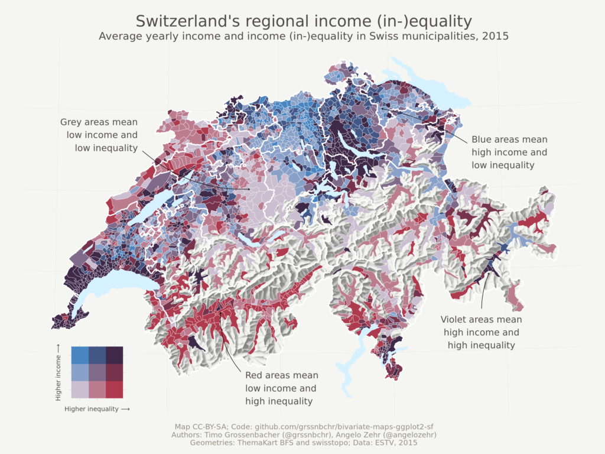
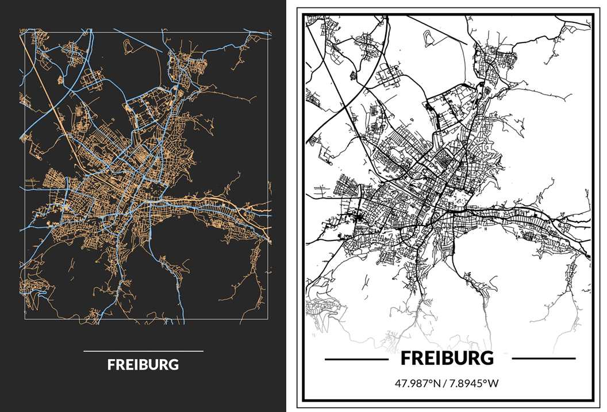

layout: true

```{r init-chunk, include = FALSE}
# load all packages
source("../../R/load_packages.R")

opts_chunk$set(echo = TRUE, fig.align = "center", message = FALSE, cache = TRUE)

# load course content table
source("../../R/course_content.R")

options(warn = -1)

xaringanExtra::use_xaringan_extra(c("tile_view", "clipboard"))
xaringanExtra::use_extra_styles(
  hover_code_line = TRUE,         #<<
  mute_unhighlighted_code = FALSE  #<<
)
```

---

## Check-In and Q&A

Short Check-In: [Click here](https://www.menti.com/efi4iyigyg).

--

Any questions remaining from the last session you need us to answer?

---
## Workshop Evaluation
.pull-left[
.center[
```{r evaluation-meme, echo = FALSE}

```
]
.center[
<small><small>[Memegenerator](https://memegenerator.net/instance/65814822/prepare-yourself-evaluation-time-is-coming)</small></small>
]
]

--

.pull-right[
Even though some more cool stuff is yet to come:

Please log into [ILIAS](https://ilias.gesis.org/goto.php?target=crs_25075_rcodeAQeEHPgRGV&client_id=gesis) for the workshop evaluation.
]

---

## What is `ggplot2`?

`ggplot2` is well-known for creating plots.
Thanks to our `sf` working environment, we can exploit all amazing `ggplot2` functions.
Trust us, before `sf`, making maps was way more complicated.

--

In general, on `ggplot2`:

- well-suited for multi-dimensional data
- expects data (frames) as input
- components of the plot are added as layers

```{r, eval = F}

plot_call +
  layer_1 +
  layer_2 +
  ... +
  layer_n

```

---

## From `tmap` to `ggplot2`

Reminder: We played around with `tmap` yesterday, and the results were already pretty nice.
`ggplot2` allows us to customize our maps even more, draw on previous knowledge of the package and increase the possibilities to combine maps, plots, and more.

The good thing: the inner logic of `tmap` and `ggplot2` is the same and is based on the *grammar of graphics*.

--

If you are new to `ggplot2`, you might want to check out:
  - [ggplot2 - Elegant Graphics for Data Analysis](https://www.springer.com/gp/book/9783319242750) by Hadley Wickham
  - [BBC Visual and Data Journalism cookbook for R graphics](https://bbc.github.io/rcookbook/#how_to_create_bbc_style_graphics)
  - [ggplot2 extensions](http://www.ggplot2-exts.org/gallery/)


---

## Components of a Plot

According to Wickham ([2010, 8](http://dx.doi.org/10.1198/jcgs.2009.07098)), a layered plot consists of the following components:

- data and aesthetic mappings,
- geometric objects,
- scales,
- (and facet specification)

```{r plot call example, eval = FALSE, echo = TRUE}

plot_call +
  data +
  aesthetics +
  geometries +
  scales +
  facets

```

---

## Let us start building some maps!

First: Get the data!

```{r get-data-display, eval = F}

library(sf)
library(ggplot2)

attributes_districts <-  read.csv("./data/attributes_districts.csv", 
                                  header = T, fill = T, sep = ",") 

german_districts_enhanced <- st_read(dsn = "./data",
                           layer = "GER_DISTRICTS") %>% 
                           rename(., district_id = id) %>% 
                          st_transform(., crs = 3035) %>% 
                          left_join(., attributes_districts, by = "district_id")
                                  
german_states <- st_read(dsn = "./data", layer = "GER_STATES") %>% 
                  st_transform(. , 3035)

```

```{r get-data, echo = F}

german_districts <- st_read(dsn = "../../data",
                           layer = "GER_DISTRICTS",
                           quiet = T) %>% 
                     rename(., district_id = id)

attributes_districts <-  read.csv("../../data/attributes_districts.csv", 
                                  header = T, fill = T, sep = ",") 
                                  
german_districts_enhanced <- 
        german_districts %>% 
        left_join(., attributes_districts, by = "district_id") %>% 
        st_transform(., crs = 3035)
                
german_states <- st_read(dsn = "../../data", layer = "GER_STATES",
                         quiet = T) %>% 
                  st_transform(. , 3035)

```

---

## And I'm proudly presenting...

.pull-left[
```{r first-map, eval = FALSE}
# a simple first map 
ggplot() +
 geom_sf(data = german_districts_enhanced)
```
]

--

.pull-right[
```{r firstmap-plot, echo = FALSE}
# a simple first map 
ggplot() +
 geom_sf(data = german_districts_enhanced)
```
]

---

## Making a Plan

This map will be our canvas for the ongoing session.
There are hundreds of options to change this map.
We will cover at least some essential building blocks:

  - *THE MAP*: adding attributes, choose from colors/palettes, adding layers
  - *THE LEGEND*: position, sizes, display
  - *THE ENVIRONMENT*: choosing from themes and build your own
  - *THE META-INFORMATION*: titles and sources
  - *THE EXTRAS*: scales and compass

--

If your working on your maps, the [ggplot2 cheatsheets](https://rstudio.com/wp-content/uploads/2016/11/ggplot2-cheatsheet-2.1.pdf) will help you with an overview of scales, themes, labels, facets, and more. 

---

## The Map Layer: A Basis

.pull-left[
```{r colorfill-map, eval = FALSE}

# easy fill with color
ggplot() +
  geom_sf(data = german_districts_enhanced, 
          fill = "purple", 
          color = "blue")

```
]

.pull-right[
```{r colorfill-plot, echo = FALSE}

# easy fill with color
ggplot() +
  geom_sf(data = german_districts_enhanced, fill = "purple", color = "blue")

```
]

---

## Add the `aesthetics` 

We'll concentrate on mapping the vote share of the German Right-Wing Populist Party (*AfD*) in the German Federal Election in 2017.

.pull-left[
```{r aesthetics, eval = FALSE}

# map aethetics
ggplot() +
  geom_sf(data = german_districts_enhanced, 
       # add the attribute we want to map
        aes(fill = afd_voteshare_2017)) + 
      # choose a continuous palette 
        scale_fill_continuous() 

```
]

--

.pull-right[
```{r aesthetics-plot, echo = FALSE}

# map aethetics
ggplot() +
  geom_sf(data = german_districts_enhanced, aes(fill = afd_voteshare_2017)) + # add the attribute we want to map
  scale_fill_continuous()  # choose a continuous palette fitting your attribute (optional)

```
]

---

## The Map Layer 

Are you having trouble choosing the right color? There are some excellent tutorials out there, f.e. by [Michael Toth](https://michaeltoth.me/a-detailed-guide-to-ggplot-colors.html).

.pull-left[
```{r viridis-map, eval = FALSE}

# change color palette
ggplot() +
  geom_sf(data = german_districts_enhanced,
          aes(fill = afd_voteshare_2017)) + 
  # readable with color vision deficiencies
    scale_fill_viridis_c(option = "plasma") 

# other option:
scale_fill_continuous(type = "viridis")
# or build you own continous palette:
scale_color_gradient
```
]


.pull-right[
```{r viridis-plot, echo = FALSE}

# change color palette
ggplot() +
  geom_sf(data = german_districts_enhanced,
          aes(fill = afd_voteshare_2017)) + 
  scale_fill_viridis_c(option = "plasma") # readable with color vision deficiencies

```
]

---

## The Map Layer 

You are changing your map, step by step.
 

.pull-left[
```{r direction-map, eval = FALSE}

ggplot() +
  geom_sf(data = german_districts_enhanced, 
          aes(fill = afd_voteshare_2017), 
           # make the borders disappear
          color = NA) +
  scale_fill_viridis_c(option = "plasma",
          # change scale direction
           direction = -1)  

```
]


.pull-right[
```{r direction-plot, echo = FALSE}

ggplot() +
  geom_sf(data = german_districts_enhanced, 
          aes(fill = afd_voteshare_2017), 
          color = NA) + # make the borders transparent
  scale_fill_viridis_c(option = "plasma", direction = -1)  # change scale direction

```
]

---

## Add another Shapefile 

.pull-left[
```{r 2ndlayer, eval = FALSE}

# realizing that my shapefile includes
# polygons of oceans and lakes
# easy fix on the fly when you know your data
german_states <-
  german_states %>% 
  filter(., GF == 4 )

# add layer with German states
ggplot() +
  geom_sf(data = german_districts_enhanced, 
          aes(fill = afd_voteshare_2017), 
          color = NA) + 
  scale_fill_viridis_c(option = "plasma", 
                       direction = -1) +
   # add another layer
  geom_sf(data = german_states, 
          # filling transparent
          fill = "transparent",
          # color of borders
          color = "white", 
          # size of borders
          size = 1) 

```
]


.pull-right[
```{r 2ndlayer-plot, echo = FALSE}

# shoot I got a weird outline I don't want in my shapefile, let's fix it
german_states <-
  german_states %>% 
  filter(., GF == 4 )

# add layer with the boundaries of the German state
ggplot() +
  geom_sf(data = german_districts_enhanced, 
          aes(fill = afd_voteshare_2017), 
          color = NA) + 
  scale_fill_viridis_c(option = "plasma", direction = -1) +
  geom_sf(data = german_states,         # add another layer
          fill = "transparent", 
          color = "white", 
          size = 1) 


```
]

---

## Dealing with the Legend 

You can deal with everything concerning the legend (labels, titles, width...) within the scale argument.
The only thing you cannot change here is the position in relation to the map.

.pull-left[
```{r legend, eval = FALSE}

ggplot() +
  geom_sf(data = german_districts_enhanced, 
          aes(fill = afd_voteshare_2017), 
          color = NA) + 
  scale_fill_viridis_c(option = "plasma",
                       direction = -1,
                    # add a legend title
                    name = "AfD Vote Share",
                    # adjust legend
                    guide = guide_legend (
                    # turn it horizontal
                    direction= "horizontal",
                    # put the labels
                    # under the legend bar
                    label.position = "bottom")) + 
  geom_sf(data = german_states, 
          fill = "transparent", 
          color = "white") 

# check the help file for more options
?guide_legend

```
]


.pull-right[
```{r legend-plot, echo = FALSE}

ggplot() +
  geom_sf(data = german_districts_enhanced, 
          aes(fill = afd_voteshare_2017), 
          color = NA) + 
  scale_fill_viridis_c(option = "plasma", direction = -1,
                       name = "AfD Vote Share", # add a legend title
                       guide = guide_legend (
                         direction= "horizontal", # turn it horizontal
                         label.position = "bottom")) + # put the labels under the legend bar
  geom_sf(data = german_states, 
          fill = "transparent", 
          color = "white") 

```
]

---

## Save and Reuse

Maps produced with `ggplot2` are standard objects like any other object in `R` (they are lists). We can just assign them to re-use, plot later, and add map layers.

Furthermore, you can save them just as any `ggplot2` graph.
The `ggsave()` function automatically detects the file format. You can also define the height, width, and dpi, which is particularly useful to produce high-class graphics for publications.

---

## Save and Reuse


```{r eval = FALSE}

# assign to object
afd_map <- 
ggplot() +
  geom_sf(data = german_districts_enhanced, 
          aes(fill = afd_voteshare_2017), 
          color = NA) + 
  scale_fill_viridis_c(option = "plasma",
                       direction = -1,
                    name = "AfD Vote Share",
                    guide = guide_legend (
                    direction= "horizontal",
                    label.position = "bottom")) + 
  geom_sf(data = german_states, 
          fill = "transparent", 
          color = "white") 
 
# save as png-file
ggsave("afd_map.png", afd_map, dpi = 300)

```

---


## The overall `theme` of your map 

.pull-left[
```{r afdmap, eval = FALSE}

afd_map <- 
ggplot() +
  geom_sf(data = german_districts_enhanced, 
          aes(fill = afd_voteshare_2017), 
          color = NA) + 
  scale_fill_viridis_c(option = "plasma",
                       direction = -1,
                    name = "AfD Vote Share",
                    guide = guide_legend (
                    direction= "horizontal",
                    label.position = "bottom")) + 
  geom_sf(data = german_states, 
          fill = "transparent", 
          color = "white")  

afd_map
```
]

--

.pull-right[
```{r afdmap-plot, echo = FALSE}

afd_map <- 
  ggplot() +
  geom_sf(data = german_districts_enhanced, 
          aes(fill = afd_voteshare_2017), 
          color = NA) + 
  scale_fill_viridis_c(option = "plasma", direction = -1,
                       name = "AfD Vote Share", # add a legend title
                       guide = guide_legend (
                         direction= "horizontal", # turn it horizontal
                         label.position = "bottom")) + # put the labels under the legend bar
  geom_sf(data = german_states, 
          fill = "transparent", 
          color = "white")  

afd_map

```
]

---

## Get rid of everything?!

The `theme` controls all 'non-data' display.
If you want to get rid of the default `ggplot2` theme, you can do so.
But instead of getting rid of everything, you might want to try out the built-in themes.

.pull-left[
```{r theme, eval = FALSE}
# use the object afd_map as base layer
afd_map +
  # empty your theme
  theme_void() 


# ... or add another
theme_bw()
theme_gray()
theme_light()

# check all themes here
?theme

```
]

--

.pull-right[
```{r theme-plot, echo = FALSE}

ggplot() +
  geom_sf(data = german_districts_enhanced, aes(fill = afd_voteshare_2017), color = NA) + 
  scale_fill_viridis_c(option = "plasma", direction = -1,
                       name = "AfD Vote Share",
                       guide = guide_legend (
                         direction= "horizontal",
                         label.position = "bottom")) +
  geom_sf(data = german_states, fill = "transparent", color = "white") +
  theme_void() # empty your theme

```
]

---

## Build your own `theme` 

.pull-left[
```{r buildtheme-map, eval = FALSE}
# building a theme
afd_map +
  theme_void() + 
        # bold text elements
  theme(title = element_text
                (face = "bold"), 
        # move legend to bottom of map
        legend.position = "bottom", 
        # change background color
        panel.background = 
          element_rect(fill = "lightgrey"))

```
]

--

.pull-right[
```{r buildtheme-plot, echo = FALSE}

ggplot() +
  geom_sf(data = german_districts_enhanced, aes(fill = afd_voteshare_2017), color = NA) + 
  scale_fill_viridis_c(option = "plasma", direction = -1,
                       name = "AfD Vote Share",
                       guide = guide_legend (
                         direction= "horizontal",
                         label.position = "bottom")) +
  geom_sf(data = german_states, fill = "transparent", color = "white") +
  theme_void() + 
  theme(title=element_text(face='bold'), # bold legend text
        legend.position = 'bottom', # move legend to the bottom of the map
        panel.background = element_rect(fill = "lightgrey")) # change background color


```
]

---

## Adding `labs`

There is one necessary step to do. You should always make sure to include and cite your data sources. Especially in graphs and maps, you can use a short version to include them in the description directly.

.pull-left[
```{r labs-map-disp, eval = FALSE}

afd_map +
        # add title
  labs(title = "Electoral Success AfD",   
       # add sub-title
       subtitle = 
         "German Federal Elections 2017",   
       # add source
       caption = 
         c("© Der Bundeswahlleiter, Wiesbaden 
           2018 & © GeoBasis-DE / BKG 2021")) 

```
]

--

.pull-right[
```{r labs-maps, echo = F}

ggplot() +
  geom_sf(data = german_districts_enhanced, 
          aes(fill = afd_voteshare_2017), 
          color = NA) + 
  scale_fill_viridis_c(option = "plasma",
                       direction = -1,
                       name = "AfD Vote Share",
                       guide = guide_legend (
                        direction= "horizontal",
                         label.position = "bottom")) + 
  geom_sf(data = german_states, 
          fill = "transparent", 
          color = "white") +
  theme_void() + 
  theme(title=element_text(face='bold'), 
        legend.position = 'bottom') +
      # add title
  labs(title="Electoral Success AfD",   
       # add sub-title
       subtitle= "German Federal Elections 2017",   
       # add source
       caption=c("© Der Bundeswahlleiter, Wiesbaden 2018 & © GeoBasis-DE / BKG 2021")) 

```
]

---

class:middle

## Exercise 2_3_1: Advanced Maps: The Basis

[Exercise](https://stefanjuenger.github.io/gesis-workshop-geospatial-techniques-R/exercises/2_3_1_Advanced_Maps_Basis_question.html)

[Solution](https://stefanjuenger.github.io/gesis-workshop-geospatial-techniques-R/solutions/2_3_1_Advanced_Maps_Basis_solution.html)

---

## To be continued...

Our code in total has already grown pretty much. Without going into too much detail, the next slides showcase some more changes you can do with your maps
.center[
**A map is never finished until you decide not to work on it anymore.**
]

```{r complete-syntax, eval = F}

ggplot() +
  geom_sf(data = german_districts_enhanced, 
          aes(fill = afd_voteshare_2017), 
          color = NA) + 
  scale_fill_viridis_c(option = "plasma",
                       direction = -1,
                       name = "AfD Vote Share",
                       guide = guide_legend (
                        direction= "horizontal",
                         label.position = "bottom")) + 
  geom_sf(data = german_states, 
          fill = "transparent", 
          color = "white") +
  theme_void() + 
  theme(title=element_text(face='bold'), 
        legend.position = 'bottom') +
  labs(title="Electoral Success AfD",   
       subtitle= "German Federal Elections 2017",   
       caption=c("© Der Bundeswahlleiter, Wiesbaden 2018 & © GeoBasis-DE / BKG 2021")) 

```


---

## Changing the attribute to discrete
.pull-left[
```{r try-map, eval = FALSE}

# should I change my map  
# by using a discrete measure?

# recode my original variable
# with five categories
german_districts_enhanced$afd_voteshare_quant <-  
  cut(german_districts_enhanced$afd_voteshare_2017,
      breaks = c(0,5,10,13,15,Inf),
      labels=c('< 5','5-10','10-13','13-15','> 15'))

# re-use old code with two adjustments
ggplot() +
  geom_sf(data = german_districts_enhanced,
          # change variable name
          aes(fill = afd_voteshare_quant), 
          color = NA) +   
  # change to the discrete scale
  scale_fill_viridis_d(option = "plasma", 
                      direction = -1,  
                      name = "AfD Vote Share",
                      guide = guide_legend (
                      direction= "horizontal",
                      label.position = "bottom")) +
  geom_sf(data = german_states, 
          fill = "transparent", 
          color = "white") +
  theme_void() + 
  theme(title=element_text(face='bold'), 
        legend.position = 'bottom') +
  labs(title="Electoral Success AfD",                               
       subtitle= "German Federal Elections 2017",                  
       caption=c("© Der Bundeswahlleiter, Wiesbaden 
                 2018 © GeoBasis-DE / BKG 2021")) 

```
]

--

.pull-right[
```{r try-plot, echo = FALSE}

# should i change my map map by using a discrete measure?
german_districts_enhanced$afd_voteshare_quant <-  
  cut(german_districts_enhanced$afd_voteshare_2017,
      breaks = c(0,5,10,13,15,Inf),
      labels=c('< 5','5-10','10-13','13-15','> 15'))

# re-use old code
ggplot() +
  geom_sf(data = german_districts_enhanced, aes(fill = afd_voteshare_quant), # change variable name
          color = NA) +   
  scale_fill_viridis_d(option = "plasma",  # change to the discrete scale
                       direction = -1,  
                       name = "AfD Vote Share",
                       guide = guide_legend (
                         direction= "horizontal",
                         label.position = "bottom")) +
  geom_sf(data = german_states, fill = "transparent", color = "white") +
  theme_void() + 
  theme(title=element_text(face='bold'), 
        legend.position = 'bottom') +
  labs(title="Electoral Success AfD",                               
       subtitle= "German Federal Elections 2017",                  
       caption=c("© Der Bundeswahlleiter, Wiesbaden 2018 & © GeoBasis-DE / BKG 2021"))

```
]

---

## Creating a city layer for city labels


```{r german-cities-disp}

# create a german city layer by choosing the five districts
# with the highest pop density

german_cities <-
  german_districts_enhanced %>% 
  # calculate pop_dens
  mutate(pop_dens = population / 
           st_area(german_districts_enhanced)) %>% 
  # filter top 5 observation with highs pop_dens
  top_n( . , 5, pop_dens) %>% 
  # take the centroid of each polygon and turn to
  # polygon file into a shapefile
  st_centroid() %>% 
  # add the coordinates as X and Y column
  bind_cols(. , as.data.frame(st_coordinates(.))) %>% 
  # add some city names as labels
  bind_cols(. , data.frame(names = c("City 1", 
                                 "City 2", 
                                 "City 3", 
                                 "City 4", 
                                 "City 5")))

german_cities %>% 
  dplyr::select(.,pop_dens, X, Y)


```

---

## Add City Labels

Using `geom_label` to get a text box that holds a character string associated with an X- and Y-coordinate

.pull-left[
```{r geom-label-disp, eval = F}

afd_map +
  # add the label
   geom_label(data = german_cities, 
               # don't need sf object but columns 
                # with x- and  y-coordinate
             aes(x = X, y = Y, 
                 # column holding the character
                 # vector with strings
                  label = names),
                  # size of labels
                  size = 3,
                  # transparency
                  alpha = .8) 
  

```
]

--


.pull-left[
```{r geom-lab, echo = F}

afd_map +
  # add the label
   geom_label(data = german_cities, 
               # don't need sf object but columns 
                # with x- and  y-coordinate
             aes(x = X, y = Y, 
                 # column holding the character
                 # vector with strings
                  label = names),
                  # size of labels
                  size = 3,
                  # transparency
                  alpha = .8) 
  

```
]


---

## Having fun with point layers...

... and moving around the labels with the package `ggrepel`.

.pull-left[
```{r point-layers-disp, eval = F}

afd_map +
  # add cities as point layers
    geom_point(data = german_cities,
             aes(x = X, y = Y),
             # color of points
                 color = "black",
             # transparency of points
                  alpha = 0.6,
             # size of points
                  size = 5) +
  # ggrepel to move geometric objects
  ggrepel::geom_label_repel(data = german_cities, 
                            # the coordinates as columns              
                            aes(x = X, y = Y, 
                                label = names),
                            size = 3,
                            alpha = .8,
                            # connect label and 
                            #original data oint via line
                            min.segment.length = unit(0, 'lines')) 


```
]

--

.pull-right[
```{r point-layers, echo = F}

afd_map +
  # add cities as point layers
    geom_point(data = german_cities,
             aes(x = X, y = Y),
             # color of points
                 color = "black",
             # transparency of points
                  alpha = 0.6,
             # size of points
                  size = 5) +
  # ggrepel to move geometric objects
  ggrepel::geom_label_repel(data = german_cities, 
                            # the coordinates as columns              
                            aes(x = X, y = Y, 
                                label = names),
                            size = 3,
                            alpha = .8,
                            # connect label and 
                            #original data oint via line
                            min.segment.length = unit(0, 'lines')) 


```
]

---

## `ggplot2` and raster data

You can also use `ggplot2` to create maps with `raster data`. There are several ways to do so, but Stefan recommends the `geom_stars` building block. Here an example with some (small) adjustments.

.pull-left[
```{r raster-example-disp, eval = F}

cologne_immigrants <-
  raster::raster("../../data/immigrants_cologne.tif")

ggplot() +
  stars::geom_stars
(data = stars::st_as_stars(cologne_immigrants)) +
  # add for fixed "aspect ratio"
  coord_equal() +
  # set na values transparent
  scale_fill_continuous(na.value = "transparent") +
  # remove theme
  theme_void()
```
]

--

.pull-right[
```{r raster-example, echo = F}

cologne_immigrants <-
  raster::raster("../../data/immigrants_cologne.tif")

ggplot() +
  stars::geom_stars(data = stars::st_as_stars(cologne_immigrants)) +
  # add for fixed "aspect ratio"
  coord_equal() +
  # set na values transparent
  scale_fill_continuous(na.value = "transparent") +
  # remove theme
  theme_void()
```
]

---

## Where `ggplot2` cannot help anymore

  
In some specific circumstances, we might realize that `ggplot2` is super powerful but just not designed to build maps.
Typical features of maps are not in the package, like a compass or scale bars.

This is where other packages might need to be installed. The good thing:
Elements of the package `ggsn` can be included as `ggplot2` layer.
Checkout [Github](http://oswaldosantos.github.io/ggsn/).

---

## The Extras

`ggsn` allows you to add, f.e. a scale bar and a north arrow.

.pull-left[
```{r add-scale, eval = F}

# add scalebar and north arrow
afd_map +
  ggsn::scalebar(data = german_districts_enhanced, 
                 dist = 100, 
                 dist_unit ="km", 
                 transform = F,
                 location = "bottomright", 
                 st.bottom = T, 
                 st.size = 2.5) +
  ggsn::north(data = german_districts_enhanced, 
              location = "bottomleft")


```
]

.pull-right[
```{r add-scale-plot, echo = FALSE}
afd_map <-
afd_map +
  theme_void() + 
  theme(title=element_text(face='bold'), 
        legend.position = 'bottom') +
  labs(title="Electoral Success AfD",                               # add titl
       subtitle= "German Federal Elections 2017",                   # add sub-title
       caption=c("© Der Bundeswahlleiter, Wiesbaden 2018 & © GeoBasis-DE / BKG 2021")) + # add source
  ggsn::scalebar(data = german_districts_enhanced, dist = 100, dist_unit ="km", transform = F,
                 location = "bottomright", st.bottom = T, st.size = 2.5) +
  ggsn::north(data = german_districts_enhanced, location = "bottomleft")

afd_map


```
]

---

class:middle

## Exercise 2_3_2:

.center[**Create your Best Map!**]

---

class: middle
## The Map-Off


---


## Customize the Customized Maps

You can also annotate plots with titles, subtitles, captions, and tags. 

You can also nest plots and introduce more complex layouts by using `patchwork`([repository on *GitHub*](https://github.com/thomasp85/patchwork)) or `cowplot` ([tutorial on inset maps](https://upgo.lab.mcgill.ca/2019/12/13/making-beautiful-maps/))

---

## Inset Map: Annes First Try!

```{r inset-map, echo = F}

# Adjust the original AfD map
afd_map_adj <-
  ggplot() +
    geom_sf(data = german_districts_enhanced, 
            aes(fill = afd_voteshare_2017), 
            color = NA) + 
    scale_fill_viridis_c(option = "plasma",
                         direction = -1,
                         name = "AfD Vote Share",
                         guide = FALSE) + 
    geom_sf(data = german_states, 
            fill = "transparent", 
            color = "white") +
    theme_void()

# Subsetting the data to NRW
nrw_districts_enhanced <-
  german_districts_enhanced %>% 
  filter( district_id >= 5000 & district_id < 6000 )

# Getting the boundary box of NRW
bbox_nrw <-
  st_as_sfc(st_bbox
            (nrw_districts_enhanced))

# drawing a black rectangle on our AfD Map
afd_map_box <-
  afd_map_adj + 
  geom_sf(data = bbox_nrw, 
          fill = NA, color = "black", size = 1.2) +
  theme_void()

# making the NRW Map
afd_map_nrw <-
  ggplot() +
  geom_sf(data = nrw_districts_enhanced, 
          aes(fill = afd_voteshare_2017), 
          color = "white") + 
  scale_fill_viridis_c(option = "plasma",
                       direction = -1,
                       name = "AfD Vote Share") +
  theme_void()

# inset map
inset_map <-
  cowplot::ggdraw() +
  cowplot::draw_plot(afd_map_nrw,
                     # size of map
                     width = 0.8, height = 0.8) +
  cowplot::draw_plot(afd_map_box, 
                     # position of map
                     x = 0.05, y = 0.65, 
                     # size of map
                     width = 0.35, height = 0.35) +
  theme(panel.border = element_rect(colour = "black", fill=NA, size=3))

inset_map

```

---

## ... and the code behind it ...

```{r inset-map-disp1, eval = F}

# Adjust the original AfD map
afd_map_adj <-
  ggplot() +
    geom_sf(data = german_districts_enhanced, 
            aes(fill = afd_voteshare_2017), 
            color = NA) + 
    scale_fill_viridis_c(option = "plasma",
                         direction = -1,
                         name = "AfD Vote Share",
                         guide = FALSE) + 
    geom_sf(data = german_states, 
            fill = "transparent", 
            color = "white") +
    theme_void()

# Subsetting the data to NRW
nrw_districts_enhanced <-
  german_districts_enhanced %>% 
  filter( district_id >= 5000 & district_id < 6000 )

# Getting the boundary box of NRW
bbox_nrw <-
  st_as_sfc(st_bbox
            (nrw_districts_enhanced))

# drawing a black rectangle on our AfD Map
afd_map_box <-
  afd_map_adj + 
  geom_sf(data = bbox_nrw, 
          fill = NA, color = "black", size = 1.2) +
  theme_void()


```

---

##  ...

```{r inset-map-disp2, eval = F}


# making the NRW Map
afd_map_nrw <-
  ggplot() +
  geom_sf(data = nrw_districts_enhanced, 
          aes(fill = afd_voteshare_2017), 
          color = "white") + 
  scale_fill_viridis_c(option = "plasma",
                       direction = -1,
                       name = "AfD Vote Share") +
  theme_void()

# inset map
inset_map <-
  cowplot::ggdraw() +
  cowplot::draw_plot(afd_map_nrw,
                     # size of map
                     width = 0.8, height = 0.8) +
  cowplot::draw_plot(afd_map_box, 
                     # position of map
                     x = 0.05, y = 0.65, 
                     # size of map
                     width = 0.35, height = 0.35) +
  theme(panel.border = element_rect(colour = "black", fill = NA, size = 3))

inset_map
```


---

## The Art of Mapping

There are quite a few examples of how far we can get when mastering the art of mapping with `ggplot2`.
And the best thing you can do is to learn from others.
 For example, [Timo Grossenbacher](https://timogrossenbacher.ch/2019/04/bivariate-maps-with-ggplot2-and-sf/) designed this beautiful map. You can find all of his code online!

.center[
```{r swiss-map, echo = FALSE, out.width = "80%"}

```
]


---

## More inspiration

.pull-left[
```{r stree-map, echo = FALSE, out.width = "90%"}

```
]

.pull-right[
You can find inspiration all over the web:

- Super nice tutorial to actual design artworks like these by [gplot2tutor]( https://ggplot2tutor.com/streetmaps/streetmaps/)
- Get Inspired by our GIS friends working on the [ArcGIS Blog]( https://www.esri.com/arcgis-blog/overview/)
- Check Out [R Graph Gallery](https://www.r-graph-gallery.com/) for Hexbins and Bubble Maps.
]
 

---

## And don't forget


**Try and error goes a long way**.
If your frustration is exceptionally high, you might want to find some comfort in [this Twitter account](https://twitter.com/accidental__art?lang=en) account which collects `ggplot2` graphs which turned into art instead of a useful visualization.


---

layout: false
class: center
background-image: url(./img/the_end.png)
background-size: cover

.left-column[
</br>
```{r pic-me, echo = FALSE, out.width = "90%"}
knitr::include_graphics("./img/anne.png")
```
]

.right-column[
.left[.small[`r icon::fontawesome("envelope")` [`anne-kathrin.stroppe@gesis.org`](mailto:anne-kathrin.stroppe@gesis.org)] </br>
.small[`r icon::fontawesome("twitter")` [`@AStroppe`](https://twitter.com/AStroppe)] </br>
.small[`r icon::fontawesome("github")` [`Stroppan`](https://github.com/stroppan)] </br>
]
]