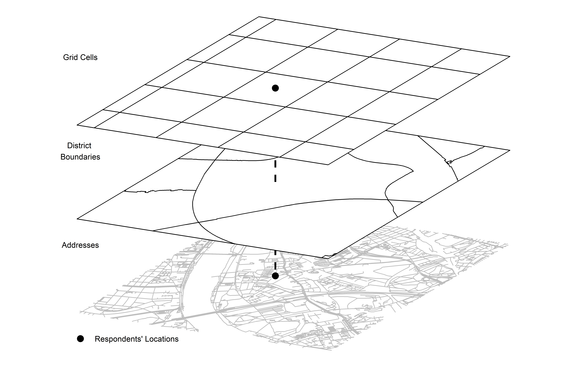

layout: true

```{r init-chunk, include = FALSE}
# load all packages
source("../../R/load_packages.R")

# load course content table
source("../../R/course_content.R")

opts_chunk$set(echo = TRUE, fig.align = "center", message = FALSE, cache = TRUE)

options(warn = -1)

xaringanExtra::use_xaringan_extra(c("tile_view", "clipboard"))
xaringanExtra::use_extra_styles(
  hover_code_line = TRUE,         #<<
  mute_unhighlighted_code = FALSE  #<<
)
```

---

## Now

```{r course-content-now, echo = FALSE}
course_content %>%
  kableExtra::row_spec(10, background = "yellow")
```

---

## What we aim to learn in this session

```{r 3d-pic, echo = FALSE}

```

---

## How we are going to do it?

We will make use of
- `sf`'s excellent interface to straightforward manipulate the `geometry` column
- barebones `ggplot2` again
- most importantly, some mathematical voodoo for rotating the data, called affine transformation

---

## A lay persons's explanation of the mathematical background

Creating a 3D map comprises two steps

1. Shearing the geometries
2. Rotating the geometries

---

## Shearing

Shearing or shear mapping is a method of geometric data transformation which 'distorts' the data while preserving the size of the area
- with a signed distance in reference
- to a fixed line or point

--

.pull-left[
From this...
```{r square, echo = FALSE, out.width = "70%"}
square <- 
  sf::st_point(1:2) %>% 
  sf::st_sfc() %>%
  sf::st_sf() %>% 
  sf::st_buffer(
    10, 
    endCapStyle = "SQUARE"
  )

plot(square)
```
]

--

.pull-right[
...to this.
```{r square-sheared, echo = FALSE, out.width = "100%"}
square_sheared <- 
  square %>% 
  dplyr::mutate(geometry = .$geometry * matrix(c(2, 1.2, 0, 1), 2, 2))

plot(square_sheared)
```
]

---

## Rotation

In our example, rotation serves an aesthetic purpose: 
- the horizontal line should not be horizontal
- you don't need that necessarily

.pull-left[
From this...
```{r square-sheared-2, echo = FALSE, out.width = "100%"}
plot(square_sheared)
```
]

--

.pull-right[
...to this.
```{r square-sheared-rotated, echo = FALSE, out.width = "100%"}
square_sheared_rotated <- 
  square_sheared %>% 
  dplyr::mutate(
    geometry = 
      .$geometry * 
      matrix(c(cos(pi/20), sin(pi/20), -sin(pi/20), cos(pi/20)), 2, 2)
  )

plot(square_sheared_rotated)
```
]

---

## Formula

So we not only multiply any point in our data with a shear matrix, which serves the shear transformation, but also a rotation matrix:

$${[x,y]} \times \underbrace{\begin{bmatrix}2   & 0  \\ 1.2 & 1 \end{bmatrix}}_\text{Shear Matrix} \times \underbrace{\begin{bmatrix} \cos(\frac{\pi}{20}) & \sin(\frac{\pi}{20}) \\ -\sin(\frac{\pi}{20}) & \cos(\frac{\pi}{20})\end{bmatrix}}_\text{Rotation Matrix} \underbrace{(+ \begin{bmatrix}x\_add & y\_add \end{bmatrix})}_\text{Optional Additions}$$

At the end of this operation, we can also add an $x$ or $y$ offset value to move the whole thing in two-dimensional space. This creates this layer optic, as we've seen in the beginning.

---

## R Implementation

```{r fun-rotate-data}
rotate_data <- function(data, x_add = 0, y_add = 0) {
  
  shear_matrix <- function () { 
    matrix(c(2, 1.2, 0, 1), 2, 2) 
  }
  
  rotate_matrix <- function(x) { 
    matrix(c(cos(x), sin(x), -sin(x), cos(x)), 2, 2) 
  }
  
  data %>% 
    dplyr::mutate(
      geometry = 
        .$geometry * shear_matrix() * rotate_matrix(pi/20) + c(x_add, y_add)
    )
}
```

---

## Let's start with a simple square

Using `sf`, we can create a basic rectangle more or less just like in a drawing program.

.pull-left[
```{r simple-square}
simple_square <-
  sf::st_point(1:2) %>% 
  sf::st_sfc() %>%
  sf::st_sf() %>% 
  sf::st_buffer(
    10, 
    endCapStyle = "SQUARE"
  )
```
]

--

.pull-right[
```{r simple-square-map}
ggplot() +
  geom_sf(data = simple_square)
```
]

---

## Application of our pre-defined function 

What is nice about the pre-defined function is that we can simply unleash it on our drawn rectangle

.pull-left[
```{r simple-square-rotated}
simple_square_rotated <-
  simple_square %>% 
  rotate_data()
```
]

--

.pull-right[
```{r simple-square-rotated-map}
ggplot() +
  geom_sf(data = simple_square_rotated)
```
]

---

## Adding multiple layers

We can also recycle our rectangle and adding a `y` offset value.

.pull-left[
```{r simple-square-rotated-multiple-layers, eval = FALSE}
ggplot() +
  geom_sf(
    data = 
      simple_square %>% 
      rotate_data()
  ) +
  geom_sf(
    data = 
      simple_square %>% 
      rotate_data(y_add = 15)
  )
```
]

--

.pull-right[
```{r simple-square-rotated-multiple-layers-exec, ref.label = "simple-square-rotated-multiple-layers", echo = FALSE}
```
]

---

## What's next?

You can do this rotation stuff with any geometry:
- points
- lines
- polygons

In the upcoming exercise, you will get used to apply the function by rotating multiple different geometries. But first, we are going to learn from one more geospatial technique as a prerequisite...

---

## Geocoding!

Our geometries should be centered around a specific point in space. In principle, we can use an arbitrary point in space. 

However, wouldn't it be nice to start from a place or address your familiar with? You can use geocoding to retrieve the place's point in space:
- conversion from an address to a geocoordinate
- there are multiple providers of such a service
  - we can use OpenstreetMap!
  
---

## Geocoding the GESIS Cologne Address

```{r geocoding-gesis}
gesis_cologne <-
  tmaptools::geocode_OSM(
    "Unter Sachsenhausen 6, 50667 Köln", 
    as.sf = TRUE,
    geometry = "point"
    ) %>% 
  sf::st_transform(3035) %>% 
  dplyr::select(query, geometry = point)

gesis_cologne
```

---

class:middle

## Exercise 2_4_1: Pre-Shaping Data

[Exercise](https://stefanjuenger.github.io/gesis-workshop-geospatial-techniques-R/exercises/2_4_1_Pre-Shaping_Data_question.html)

[Solution](https://stefanjuenger.github.io/gesis-workshop-geospatial-techniques-R/exercises/2_4_1_Pre-Shaping_Data_solution.html)

---

## Going crazy: Adding custom elements

Some additional packages for `ggplot2` already provide functionalities to add custom elements
- scale bars
- compasses

However, they are often small images added to the plot, which makes rotating them a bit hard.

**Thus, we just draw them ourselves as additional `sf` geometries.**

---

## Basic scale bar: prerequisites

```{r bboxing, include = FALSE}
bboxing <- function(input_point) {
  sf::st_bbox(
    c(
      xmin = sf::st_coordinates(input_point)[1] - 1000,
      xmax = sf::st_coordinates(input_point)[1] + 1000,
      ymax = sf::st_coordinates(input_point)[2] + 1000,
      ymin = sf::st_coordinates(input_point)[2] - 1000
    ),
    crs = sf::st_crs(3035)
  )
}
```

First, let's use our `bboxing()` function from the previous exercise:

```{r gesis-bbox}
gesis_bbox <- bboxing(gesis_cologne)
```

It's the frame we are orientating on for 'drawing'. Just like your canvas in MS paint...

---

## Basic scale bar: the whole thing

Scalebars have a specific length. We define it here by restructuring our pre-defined frame.

.pull-left[
```{r scalebar-frame}
gesis_cologne_scalebar <- 
  (gesis_bbox + c(1000, 0, 0, -1950)) %>% 
  sf::st_as_sfc() %>%
  sf::st_sf()
```
]

--

.pull-right[
```{r scalebar-frame-plot}
plot(gesis_cologne_scalebar)
```
]

---

## Basic scale bar: sections

Often scalebars include sections for measuring distances. That's something we can also draw and add to our scalebar.

.pull-left[
```{r scalebar-sections}
gesis_cologne_scalebar <-
  rbind(
    gesis_cologne_scalebar %>% 
      {sf::st_bbox(.) + c(750, 0, 0, 0)} %>% 
      sf::st_as_sfc() %>%
      sf::st_sf(),
    gesis_cologne_scalebar %>% 
      {sf::st_bbox(.) + c(500, 0, -250, 0)} %>% 
      sf::st_as_sfc() %>%
      sf::st_sf(),
    gesis_cologne_scalebar %>% 
      {sf::st_bbox(.) + c(250, 0, -500, 0)} %>% 
      sf::st_as_sfc() %>%
      sf::st_sf(),
    gesis_cologne_scalebar %>% 
      {sf::st_bbox(.) + c(0, 0, -750, 0)} %>%
      sf::st_as_sfc() %>%
      sf::st_sf()
  )
```
]

--

.pull-right[
```{r scalebar-sections-plot}
plot(gesis_cologne_scalebar)
```
]

---

## Unrotated map with scalebar

Let's have a look at our map inluding our custom scalebar.

```{r gesis-roads, include = FALSE}
gesis_roads <-
  osmdata::getbb("Köln") %>% 
  osmdata::opq(timeout = 25*100) %>%
  osmdata::add_osm_feature(
    "highway", 
    c("trunk", "primary", "secondary", "tertiary")
  )%>% 
  osmdata::osmdata_sf() %>% 
  .$osm_lines %>% 
  sf::st_transform(3035) %>% 
  sf::st_crop(gesis_bbox)
```

.pull-left[
```{r unrotated-map, eval = FALSE}
ggplot() +
  geom_sf(data = gesis_roads) +
  geom_sf(
    data = gesis_cologne_scalebar,
    color = "black",
    fill = rep(c("black", "white"), 2)
  ) +
  ggsn::blank()
```
]

--

.pull-right[
```{r unrotated-map-exec, ref.label = "unrotated-map", echo = FALSE}
```
]

---

## Rotated map with a scalebar

And now let's see how it perform when roating the whole map.

.pull-left[
```{r rotated-map, eval = FALSE}
ggplot() +
  geom_sf(
    data = 
      gesis_roads %>% 
      rotate_data()
  ) +
  geom_sf(
    data = 
      gesis_cologne_scalebar %>% 
      rotate_data(x_add = -150, y_add = -100),
    color = "black",
    fill = rep(c("black", "white"), 2)
  ) +
  
  annotate("text", 
           x = gesis_cologne_scalebar %>% 
             rotate_data(x_add = -150, y_add = -100) %>% 
             sf::st_bbox() %>% 
             .$xmin, 
           y = gesis_cologne_scalebar %>% 
             rotate_data(x_add = -150, y_add = -100) %>% 
             sf::st_bbox() %>% 
             .$ymax - 150,
           label = "0 km",
           angle = -12,
           size = 3
  ) +
  annotate("text", 
           x = gesis_cologne_scalebar %>% 
             rotate_data(x_add = -150, y_add = -100) %>% 
             sf::st_bbox() %>% 
             .$xmax - 200, 
           y = gesis_cologne_scalebar %>% 
             rotate_data(x_add = -150, y_add = -100) %>% 
             sf::st_bbox() %>% 
             .$ymin - 130,
           label = "1 km",
           angle = -12,
           size = 3
  ) +
  ggsn::blank()
```
]

--

.pull-right[
```{r rotated-map-exec, ref.label = "rotated-map", echo = FALSE}
```
]

---

class:middle

## Exercise 2_4_2: Drawing Custom Elements

[Exercise](https://stefanjuenger.github.io/gesis-workshop-geospatial-techniques-R/exercises/2_4_2_Drawing_Custom_Elements_question.html)

[Solution](https://stefanjuenger.github.io/gesis-workshop-geospatial-techniques-R/exercises/2_4_2_Drawing_Custom_Elements_solution.html)

---

class: middle
## Break & then Wrap-up


---

layout: false
class: center
background-image: url(./img/the_end.png)
background-size: cover

.left-column[
</br>
```{r pic-me, echo = FALSE, out.width = "90%"}
knitr::include_graphics("./img/stefan.png")
```
]

.right-column[
.left[.small[`r icon::fontawesome("envelope")` [`stefan.juenger@gesis.org`](mailto:cute.cat@gesis.org)] </br>
.small[`r icon::fontawesome("twitter")` [`@StefanJuenger`](https://twitter.com/CuteCat)] </br>
.small[`r icon::fontawesome("github")` [`StefanJuenger`](https://github.com/cute_cat)] </br>
.small[`r icon::fontawesome("home")` [`https://stefanjuenger.github.io`](https://www.cute-cat.org)]] </br>
]
